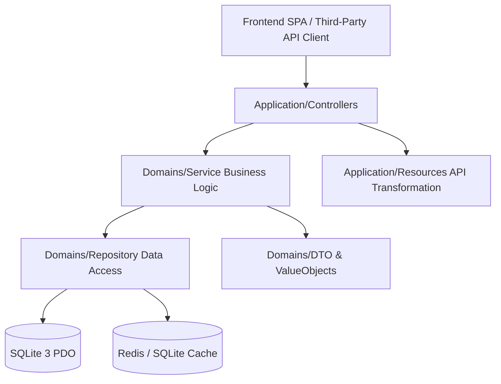

# AlleyNote Bulletin Board Platform

> Modern high-performance bulletin board platform built with **Domain-Driven Design (DDD)** · PHP 8.4 custom HTTP engine + SQLite 3 + Buildless Native ES6 SPA


[](https://github.com/cookeyholder/AlleyNote/actions/workflows/ci.yml)
[](LICENSE)

---

## 📖 Overview

**AlleyNote** is a modern, enterprise-grade bulletin board and announcement platform engineered for high extensibility, maximum performance, and strict security without relying on heavy monolith frameworks.

The backend is architected strictly following **Domain-Driven Design (DDD)** principles on top of a custom **PHP 8.4** PSR-7/PSR-15 compliant HTTP engine. The frontend is built using **buildless native ES6 Single Page Application (SPA)** modules coupled with Tailwind CSS and CKEditor 5, offering an exceptionally fast development cycle and sleek user experience.

AlleyNote features granular Role-Based Access Control (RBAC), multi-dimensional real-time analytics, an in-app notification system, Markdown bulk/single post exporting, security audit logging, and OpenAPI 3.0 (Swagger UI) interactive documentation.

---

## ✨ Key Features & Architecture Highlights

### 🏛️ Domain-Driven Design (DDD) Bounded Contexts
- **7 Independent Bounded Contexts**:
  - 📝 **Post**: Bulletin CRUD, tag associations, cache invalidation, and Markdown single/bulk exporting.
  - 🔒 **Auth**: RS256 JWT asymmetric authentication, Role-Based Access Control (RBAC), and user management.
  - 🔔 **Notification**: User notification feeds, unread count tracking, mark-as-read, and admin broadcast notifications.
  - 📊 **Statistics**: Analyzer pattern aggregation, analytics snapshots, time distribution, and dynamic charts.
  - 🛡️ **Security**: Activity logging (`user_activity_logs`), rate limiting, XSS sanitization, and security HTTP headers.
  - ⚙️ **Setting**: Global system configuration and runtime parameter management.
  - 📎 **Attachment**: File upload processing, MIME type validation, and post attachment binding.

### ⚡ Custom Lightweight High-Performance Engine
- **Zero Framework Bloat**: Custom PSR-7/PSR-15 HTTP engine powered by Nikic FastRoute and PHP-DI 7 dependency injection container.
- **SQLite 3 + PDO Optimization**: Advanced composite indexes and covering indexes delivering sub-millisecond query execution without ORM overhead.
- **Dual-Layer Caching**: Redis (Predis) with automatic graceful fallback to SQLite cache upon connection failure.

### 🔒 Enterprise-Grade Security
- **RS256 Asymmetric JWT Auth**: Secure authentication using public/private key pairs.
- **Full-Spectrum XSS Defense**: Backend HTML Purifier sanitization combined with frontend DOMPurify.
- **Strict HTTP Security Headers & CSRF**: Automatic injection of CSP (Content Security Policy), HSTS, X-Frame-Options, and CSRF protection.
- **Audit & Rate Limiting**: Full activity tracking and dynamic IP rate limiting.

### 🎨 Buildless Native Frontend
- **Pure ES6 Native Modules**: Zero Webpack, Vite, or Node.js build steps required. Code changes take effect immediately upon browser refresh.
- **Modern UI/UX**: Tailwind CSS CDN, Chart.js 4.x dynamic analytics visualizations, and CKEditor 5 rich text editor.

### 🧪 Strict Quality Assurance
- **PHPStan Level 10**: 100% compliant with the strictest static analysis level.
- **Comprehensive Testing Coverage**: 2,330+ PHPUnit unit & integration tests and Playwright E2E tests.

---

## 🧭 Reader Navigation Matrix

| Your Role | Recommended Entry Point | Description |
|-----------|------------------------|-------------|
| 🖥️ **Backend Developer** | [`docs/domains/README.md`](docs/domains/README.md) | Explore 7 Bounded Contexts, DDD dependencies, and DI rules |
| 🎨 **Frontend Developer** | [`docs/frontend/01-架構總覽.md`](docs/frontend/01-架構總覽.md) | Understand ES6 modules, SPA router, API client, and global store |
| 🔌 **API Integrator** | [`docs/api/README.md`](docs/api/README.md) | Review 112 API route definitions, Swagger UI, and test reports |
| ⚙️ **System Admin** | [`docs/guides/admin/README.md`](docs/guides/admin/README.md) | Check Docker deployment, environment variables, and security specs |
| 📝 **Content Creator** | [`docs/guides/content-creators/01-管理後台使用手冊.md`](docs/guides/content-creators/01-管理後台使用手冊.md) | Admin panel operational guide and Markdown export instructions |
| 👋 **Newcomer** | [`docs/INDEX.md`](docs/INDEX.md) | Canonical index and complete project documentation map |

---

## 🚀 Quick Start Guide

### 1. Prerequisites
- **Docker Compose**: 2.0+
- **Git**
- **Curl** (for API testing)

### 2. Setup & Installation

```bash
# 1. Clone the repository
git clone https://github.com/cookeyholder/AlleyNote.git
cd AlleyNote

# 2. Copy environment configuration
cp backend/.env.example backend/.env

# 3. Spin up Docker containers (PHP 8.4 + Nginx + Redis)
docker compose up -d
```

### 3. Application Endpoints & Default Credentials

Once started, access the following services:

- 🌐 **Public Frontend**: [http://localhost:3000](http://localhost:3000)
- ⚙️ **Admin Dashboard**: [http://localhost:3000/admin](http://localhost:3000/admin)
- 📄 **Swagger UI (Interactive API Docs)**: [http://localhost:3000/api/swagger-ui](http://localhost:3000/api/swagger-ui)
- 🔍 **OpenAPI 3.0 Spec (JSON)**: [http://localhost:3000/api/openapi.json](http://localhost:3000/api/openapi.json)

#### 🔑 Pre-configured Test Credentials

| Role | Email | Password | Scope / Permissions |
|------|-------|----------|---------------------|
| **Super Admin** | `admin@example.com` | `Admin@123456` | Full administrative privileges (Users/Roles/Settings/Broadcasts) |
| **Regular User** | `user@example.com` | `User@123456` | Standard post viewing, creation, and notification privileges |

---

## 🛠️ Development & Testing Commands

### Backend Commands (Run inside `backend/`)

```bash
composer check-all      # One-step runner: PHPStan L10 + PHP-CS-Fixer + 2330+ PHPUnit tests
composer test           # Run PHPUnit test suite
composer test-coverage  # Run tests with HTML coverage report generation
composer analyse        # Run PHPStan Level 10 static analysis
composer cs-check       # Check PHP code style (PER-CS2.0 / PHP 8.4)
composer cs-fix         # Automatically fix PHP code style
```

### Frontend Commands (Run inside `frontend/`)

```bash
npm run dev             # Start dev server (Port 3000, proxies /api -> :8081)
npm run lint            # Check frontend formatting with Prettier
npm run lint:fix        # Auto-fix frontend Prettier formatting
```

### End-to-End E2E Tests (Run inside `tests/e2e/`)

```bash
npm test                # Run Playwright headless test suite
npm run test:headed     # Run Playwright tests with browser GUI
npm run test:ui         # Launch Playwright interactive UI dashboard
```

---

## 🏗️ Architecture & DDD Layering

AlleyNote strictly separates business logic from infrastructure concerns:



### Layer Responsibilities:
- **Application Layer (`app/Application/`)**: Handles HTTP requests, controller routing, middleware pipeline, and API Resource transformations.
- **Domain Layer (`app/Domains/`)**: Contains 7 Bounded Contexts encapsulating Models, Services, ValueObjects, DTOs, and Contracts.
- **Infrastructure Layer (`app/Infrastructure/`)**: Implements database PDO persistence, Redis caching, logging, and security filters.

---

## 📁 Project Structure

```
AlleyNote/
├── backend/                 # PHP 8.4 backend engine
│   ├── app/
│   │   ├── Application/     # Controllers, Middlewares, Resources
│   │   ├── Domains/         # 7 Bounded Contexts (Post, Auth, Notification, Statistics...)
│   │   ├── Infrastructure/  # PDO, Cache, Logger, Security implementations
│   │   └── Shared/          # Shared kernel & helpers
│   ├── config/              # PHP-DI container definitions (container.php) & routes
│   ├── database/            # Phinx database migrations & seeders
│   ├── public/              # Web entry point index.php
│   └── tests/               # 8 test categories (Unit, Integration, Functional, E2E...)
├── frontend/                # Buildless native ES6 SPA frontend
│   ├── index.html           # SPA entry page
│   ├── css/                 # Custom styles
│   └── js/                  # SPA API Client, Router, Components, Pages
├── docker/                  # Docker container configs (php, nginx, redis)
├── tests/e2e/               # Playwright automated E2E tests
└── docs/                    # Complete documentation suite
    ├── decisions/           # Architecture Decision Records (ADRs)
    ├── domains/             # 7 Bounded Context deep dives
    ├── architecture/        # Backend HTTP engine & analyzer pattern docs
    ├── frontend/            # Buildless SPA frontend architecture
    ├── api/                 # OpenAPI & API developer guides
    └── runbooks/            # Development & CI/CD operational runbooks
```

---

## 🤝 Contributing

We welcome community contributions! Please follow these steps:

1. Review [`CONTRIBUTING.md`](CONTRIBUTING.md).
2. Ensure `composer check-all` passes with 100% success before submitting a pull request.
3. Update corresponding documentation files per [`DOCUMENTATION_GOVERNANCE.md`](docs/DOCUMENTATION_GOVERNANCE.md).

---

## 📜 License

Distributed under the **[MIT License](LICENSE)**.
