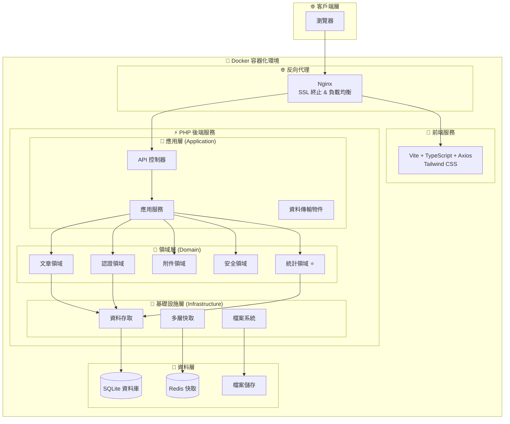

# AlleyNote 公布欄網站

[](https://github.com/your-org/alleynote/actions)
[](https://github.com/your-org/alleynote/actions)
[](https://github.com/your-org/alleynote/actions)
[](https://www.php.net)
[](https://nodejs.org)
[](LICENSE)
[](#測試流程)
[](docs/ARCHITECTURE_AUDIT.md)
[](docs/STATISTICS_FEATURE_OVERVIEW.md)

> ** 最新版本特色**
> 基於 **DDD（領域驅動設計）架構** 的現代化公告系統，整合**多維度統計模組**，提供完整的內容管理、用戶權限控制、安全防護與數據分析能力。

---

## 目錄

- [專案簡介](#專案簡介)
- [核心功能](#核心功能)
- [技術架構](#技術架構)
- [系統需求](#系統需求)
- [快速開始](#快速開始)
- [開發指南](#開發指南)
- [統計模組](#統計模組)
- [測試流程](#測試流程)
- [部署說明](#部署說明)
- [文件資源](#文件資源)
- [授權](#授權)

---

## 專案簡介

AlleyNote 是一個企業級的公告欄系統，專為學校、社區、企業等組織設計。採用領域驅動設計（DDD）架構，整合統計分析模組，支援多用戶協作、權限管理、安全控制與數據洞察。

### 🎯 設計理念
- **領域驅動**: 按業務領域劃分模組，便於維護與擴展
- **前後端分離**: 後端提供 RESTful API，前端使用現代化技術棧
- **容器化部署**: Docker 統一環境，簡化部署與運維
- **數據驅動**: 內建統計分析，支援業務決策

---

## 核心功能

### � 內容管理
- **文章系統**: 發布、編輯、分類、標籤、置頂
- **附件管理**: 多格式上傳、預覽、版本控制
- **內容審核**: 自動過濾、人工審核、狀態管理

### 👥 用戶系統
- **認證授權**: JWT Token、角色權限、會話管理
- **用戶管理**: 註冊審核、資料維護、狀態控制
- **活動記錄**: 21 種行為記錄、異常檢測、審計追踪

### 🔒 安全控制
- **存取控制**: IP 黑白名單、地理位置限制
- **攻擊防護**: CSRF、XSS、SQL Injection 防護
- **安全監控**: 異常行為檢測、自動封禁

### 📊 統計模組 ⭐
- **多維度分析**: 內容、用戶、行為統計
- **趨勢預測**: 時間序列分析、增長預測
- **視覺化儀表板**: 實時數據、互動圖表
- **快照系統**: 每日/週/月統計快照，支援歷史回溯

詳細介紹請參考：[統計功能總覽](docs/STATISTICS_FEATURE_OVERVIEW.md)

---

## 技術架構

### 🏗️ DDD 架構設計



### 🛠️ 技術棧
- **後端**: PHP 8.4.12 + DDD 架構
- **前端**: Vite 5 + TypeScript + Axios + Tailwind CSS
- **資料庫**: SQLite 3 (生產環境可擴展至 PostgreSQL/MySQL)
- **快取**: Redis (多層快取 + 工作佇列)
- **容器**: Docker + Docker Compose v2.39.2
- **Web 伺服器**: Nginx (反向代理 + SSL)

### � 專案結構
```
AlleyNote/
├── 🎨 frontend/                    # 前端應用程式
│   ├── src/                        # TypeScript 源碼
│   ├── public/                     # 靜態資源
│   └── package.json               # 前端依賴
├── ⚡ backend/                     # 後端 API
│   ├── app/                        # DDD 架構程式碼
│   │   ├── Domains/               # 領域層
│   │   ├── Application/           # 應用層
│   │   ├── Infrastructure/        # 基礎設施層
│   │   └── Shared/                # 共用組件
│   ├── config/                    # 配置檔案
│   ├── database/                  # 資料庫遷移與種子
│   ├── tests/                     # 測試套件
│   └── composer.json              # PHP 依賴
├── 📖 docs/                       # 64+ 個文件
├── 🐳 docker/                     # 容器配置
└── �️ scripts/                    # 維運腳本
```

---

## 系統需求

### 🖥️ 基本需求
- **作業系統**: Linux/macOS/Windows (支援 Docker)
- **Docker**: 28.3.3+
- **Docker Compose**: v2.39.2+
- **記憶體**: 2GB+ (推薦 4GB+)
- **儲存空間**: 5GB+

### � 開發需求
- **PHP**: 8.4.12+ (容器內提供)
- **Node.js**: 18.0+ (前端建構)
- **Composer**: 2.0+ (PHP 依賴管理)

詳細需求請參考：[系統需求文件](docs/SYSTEM_REQUIREMENTS.md)
- **100% 功能完成度**: 所有核心功能模組生產就緒
- **0 PHPStan 錯誤**: PHPStan Level 8+ 完全通過

### 🛠️ 統一腳本管理系統
- **58+ 腳本整合**: 統一為單一入口點管理
- **現代 PHP 8.4**: readonly 類別、union types、match 表達式
- **DDD 原則**: 值物件、介面分離、依賴注入
- **程式碼減少 85%**: 維護負擔大幅降低
- **統計指令整合**: 提供 `statistics:recalculation`、`statistics:status` 等命令支援資料回填與健康檢查

### 🔧 維運功能
- **自動備份**: 資料庫與檔案自動備份
- **效能監控**: 快取統計、資料庫效能分析
- **Docker 容器化**: 開發與生產環境一致
- **SSL 支援**: Let's Encrypt 自動憑證管理

---

## 技術架構

### 🎯 核心技術棧
- **後端語言**: PHP 8.4.11（強型別、現代語法）
- **Web 伺服器**: NGINX（高效能、負載均衡）
- **資料庫**: SQLite3（零設定、檔案型資料庫）
- **快取系統**: File Cache + APCu（支援分散式快取）

### 🏗️ DDD 架構組件

#### 🎯 DDD 分層架構圖

```mermaid
graph TD
    subgraph "🌐 外部介面層"
        HTTP[HTTP 請求]
        CLI[命令列介面]
    end

    subgraph "🚀 應用層 (Application Layer)"
        subgraph "🎮 控制器"
            WebCtrl[Web 控制器]
            ApiCtrl[API 控制器]
            SecurityCtrl[安全控制器]
        end

        subgraph "📦 應用服務"
            AppServices[應用服務]
            DTOs[資料傳輸物件]
            Middleware[中介軟體]
        end
    end

    subgraph "🌟 領域層 (Domain Layer)"
        subgraph "📝 文章領域"
            PostEntity[文章實體]
            PostVO[文章值物件]
            PostService[文章服務]
            PostRepository[文章倉庫介面]
        end

        subgraph "🔐 認證領域"
            AuthEntity[使用者實體]
            AuthVO[認證值物件]
            AuthService[認證服務]
            AuthRepository[認證倉庫介面]
        end

        subgraph "📎 附件領域"
            AttachmentEntity[附件實體]
            AttachmentVO[附件值物件]
            AttachmentService[附件服務]
            AttachmentRepository[附件倉庫介面]
        end

        subgraph "🛡️ 安全領域"
            SecurityEntity[安全實體]
            SecurityVO[安全值物件]
            SecurityService[安全服務]
            SecurityRepository[安全倉庫介面]
        end
    end

    subgraph "🔧 基礎設施層 (Infrastructure Layer)"
        subgraph "💾 資料持久化"
            PostRepoImpl[文章倉庫實作]
            AuthRepoImpl[認證倉庫實作]
            AttachmentRepoImpl[附件倉庫實作]
            SecurityRepoImpl[安全倉庫實作]
        end

        subgraph "⚡ 快取系統"
            CacheManager[快取管理器]
            CacheKeys[快取金鑰]
            TagSystem[標籤系統]
        end

        subgraph "📁 檔案系統"
            FileStorage[檔案儲存]
            UploadHandler[上傳處理器]
        end
    end

    subgraph "🛠️ 共用層 (Shared Layer)"
        subgraph "✅ 驗證系統"
            Validators[29種驗證規則]
            ValidationResult[驗證結果]
        end

        subgraph "⚠️ 例外處理"
            DomainExceptions[領域例外]
            AppExceptions[應用例外]
            InfraExceptions[基礎設施例外]
        end

        subgraph "🔧 工具類別"
            Helpers[輔助函式]
            Constants[常數定義]
            Enums[列舉型別]
        end
    end

    subgraph "💾 資料儲存層"
        SQLite[(SQLite 資料庫)]
        FileSystem[(檔案系統)]
    end

    %% 連接關係
    HTTP --> WebCtrl
    HTTP --> ApiCtrl
    CLI --> SecurityCtrl

    WebCtrl --> AppServices
    ApiCtrl --> AppServices
    SecurityCtrl --> AppServices

    AppServices --> DTOs
    DTOs --> Validators

    AppServices --> PostService
    AppServices --> AuthService
    AppServices --> AttachmentService
    AppServices --> SecurityService

    PostService --> PostRepository
    AuthService --> AuthRepository
    AttachmentService --> AttachmentRepository
    SecurityService --> SecurityRepository

    PostRepository --> PostRepoImpl
    AuthRepository --> AuthRepoImpl
    AttachmentRepository --> AttachmentRepoImpl
    SecurityRepository --> SecurityRepoImpl

    PostRepoImpl --> SQLite
    AuthRepoImpl --> SQLite
    AttachmentRepoImpl --> SQLite
    SecurityRepoImpl --> SQLite

    AttachmentService --> FileStorage
    FileStorage --> FileSystem

    AppServices --> CacheManager
    CacheManager --> TagSystem

    PostService --> PostEntity
    PostService --> PostVO
    AuthService --> AuthEntity
    AuthService --> AuthVO
    AttachmentService --> AttachmentEntity
    AttachmentService --> AttachmentVO
    SecurityService --> SecurityEntity
    SecurityService --> SecurityVO

    Validators --> ValidationResult
    AppServices --> Helpers

    %% 樣式定義
    classDef application fill:#e3f2fd,stroke:#1976d2,stroke-width:2px
    classDef domain fill:#fff3e0,stroke:#f57c00,stroke-width:2px
    classDef infrastructure fill:#e8f5e8,stroke:#388e3c,stroke-width:2px
    classDef shared fill:#f3e5f5,stroke:#7b1fa2,stroke-width:2px
    classDef data fill:#ffebee,stroke:#d32f2f,stroke-width:2px

    class WebCtrl,ApiCtrl,SecurityCtrl,AppServices,DTOs,Middleware application
    class PostEntity,PostVO,PostService,PostRepository,AuthEntity,AuthVO,AuthService,AuthRepository,AttachmentEntity,AttachmentVO,AttachmentService,AttachmentRepository,SecurityEntity,SecurityVO,SecurityService,SecurityRepository domain
    class PostRepoImpl,AuthRepoImpl,AttachmentRepoImpl,SecurityRepoImpl,CacheManager,CacheKeys,TagSystem,FileStorage,UploadHandler infrastructure
    class Validators,ValidationResult,DomainExceptions,AppExceptions,InfraExceptions,Helpers,Constants,Enums shared
    class SQLite,FileSystem data
```



#### 🔍 架構說明
- **Domain 層**: 業務實體、值物件、領域服務 (161 類別)
- **Application 層**: 應用服務、控制器、DTO (15 檔案)
- **Infrastructure 層**: 資料庫、外部服務、技術實作 (46 檔案)
- **Shared 層**: 共用元件、驗證器、例外處理 (20 檔案)

### 🛠️ 開發工具
- **自動化測試**: PHPUnit, PHPStan Level 8, PHPCS
- **容器化**: Docker, Docker Compose
- **依賴管理**: Composer
- **程式碼品質**: PHP-CS-Fixer

### 🔒 安全與維運
- **SSL 憑證**: Let's Encrypt 自動續簽
- **備份策略**: 自動備份與災難復原
- **作業系統**: Debian Linux 12

---

## 統一腳本管理系統

### 🚀 系統概述
基於零錯誤修復成功經驗和最新 PHP 8.4 最佳實務，我們建立了統一腳本管理系統，將原本分散的 58+ 個維運腳本整合為一個現代化、統一的管理平台。

### ⭐ 主要特色
- **統一入口點**: `php scripts/unified-scripts.php <command> [options]`
- **現代 PHP 語法**: 採用 readonly 類別、union types、match 表達式
- **DDD 原則實踐**: 值物件設計、介面分離、依賴注入
- **85% 程式碼減少**: 從 58+ 腳本減少到 9 個核心類別

### 🎯 核心功能

#### 1. 錯誤修復 (ConsolidatedErrorFixer)
```bash
# 自動修復 PHPStan 錯誤
php scripts/unified-scripts.php fix --type=type-hints

# 修復所有類型錯誤
php scripts/unified-scripts.php fix --type=all
```

#### 2. 測試管理 (ConsolidatedTestManager)
```bash
# 執行完整測試套件
php scripts/unified-scripts.php test --action=run

# 生成覆蓋率報告
php scripts/unified-scripts.php test --action=coverage
```

#### 3. 專案分析 (ConsolidatedAnalyzer)
```bash
# 完整架構分析
php scripts/unified-scripts.php analyze --type=full

# 現代 PHP 特性分析
php scripts/unified-scripts.php analyze --type=modern-php
```

#### 4. 部署管理 (ConsolidatedDeployer)
```bash
# 部署到生產環境
php scripts/unified-scripts.php deploy --env=production

# 部署到測試環境
php scripts/unified-scripts.php deploy --env=staging
```

#### 5. 維護功能 (ConsolidatedMaintainer)
```bash
# 執行完整維護
php scripts/unified-scripts.php maintain --task=all

# 清理快取
php scripts/unified-scripts.php maintain --task=cache
```

### 📊 系統狀態檢查
```bash
# 查看專案健康狀況
php scripts/unified-scripts.php status

# 列出所有可用命令
php scripts/unified-scripts.php list
```

### 🎭 展示功能
無需 Docker 環境即可體驗：
```bash
# PHP 版本展示
php scripts/demo-unified-scripts.php demo

# Bash 版本展示
./scripts/demo-unified-scripts.sh demo
```

### 📚 完整文件
- **[統一腳本使用文件](docs/UNIFIED_SCRIPTS_DOCUMENTATION.md)**: 詳細使用說明
- **[腳本遷移計劃](docs/SCRIPT_CONSOLIDATION_MIGRATION_PLAN.md)**: 整合策略與實作
- **[腳本清理報告](docs/SCRIPTS_CLEANUP_REPORT.md)**: 清理成果統計
- **[完成總結報告](docs/UNIFIED_SCRIPTS_COMPLETION_SUMMARY.md)**: 建立完成摘要
- **[統計模組概覽](docs/STATISTICS_FEATURE_OVERVIEW.md)**: 統計功能摘要與儀表板導覽 🆕

---

## 📁 專案架構

```
AlleyNote/
├── backend/                 # 後端 PHP 應用程式
│   ├── app/                # 應用程式原始碼（DDD 架構）
│   │   ├── Application/    # 應用服務層
│   │   │   ├── Controllers/ # HTTP 控制器
│   │   │   ├── DTOs/       # 資料傳輸物件
│   │   │   ├── Middleware/ # 中介軟體
│   │   │   └── Services/   # 應用服務
│   │   ├── Domains/        # 領域層
│   │   │   ├── Auth/       # 認證領域
│   │   │   ├── Post/       # 文章領域
│   │   │   ├── Attachment/ # 附件領域
│   │   │   └── Security/   # 安全領域
│   │   ├── Infrastructure/ # 基礎設施層
│   │   └── Shared/         # 共用元件
│   ├── tests/              # 測試套件（1,393 個測試）
│   │   ├── Unit/          # 單元測試
│   │   ├── Integration/   # 整合測試
│   │   ├── Security/      # 安全測試
│   │   └── Factory/       # 測試工廠
│   ├── scripts/           # 後端腳本管理系統
│   │   ├── consolidated/  # 9 個核心類別
│   │   ├── unified-scripts.php # 統一入口點
│   │   ├── demo-*.php/sh # 展示版本
│   │   └── [基礎設施腳本] # 87 個保留腳本
│   ├── public/            # 後端公開檔案
│   ├── database/          # SQLite 資料庫
│   ├── storage/           # 檔案儲存
│   ├── examples/          # 程式碼範例
│   └── coverage-reports/  # 測試覆蓋率報告
├── frontend/              # 前端 Vue.js 應用程式
│   ├── src/              # 前端原始碼
│   ├── public/           # 前端公開檔案
│   └── dist/             # 建構輸出（生產環境）
├── docs/                 # 技術文件（36 個文件）
├── docker/               # Docker 設定
├── .github/workflows/    # CI/CD 流程
├── certbot-data/         # SSL 憑證資料
---

## 文件資源

#### 🚀 快速入門
- [系統需求](docs/SYSTEM_REQUIREMENTS.md) - 硬體與軟體需求
- [管理員快速開始](docs/ADMIN_QUICK_START.md) - 5 分鐘快速部署
- [開發者指南](docs/DEVELOPER_GUIDE.md) - 開發環境設置與規範

#### 📊 統計模組文件
- [統計功能總覽](docs/STATISTICS_FEATURE_OVERVIEW.md) - 統計模組介紹 ⭐
- [統計功能規格書](docs/STATISTICS_FEATURE_SPECIFICATION.md) - 詳細功能規格
- [統計運維手冊](docs/STATISTICS_OPERATIONS_MANUAL.md) - 運維操作指南

#### 🏗️ 架構與設計
- [架構審計報告](docs/ARCHITECTURE_AUDIT.md) - DDD 架構分析
- [DI 容器指南](docs/DI_CONTAINER_GUIDE.md) - 依賴注入系統
- [驗證器指南](docs/VALIDATOR_GUIDE.md) - 29 種驗證規則

#### 🛠️ 運維管理
- [管理員手冊](docs/ADMIN_MANUAL.md) - 完整運維指南
- [部署指南](docs/DEPLOYMENT.md) - 生產環境部署
- [故障排除指南](docs/TROUBLESHOOTING_GUIDE.md) - 常見問題解決

#### 🔐 安全與認證
- [JWT 認證規格](docs/JWT_AUTHENTICATION_SPECIFICATION.md) - 認證機制
- [用戶活動記錄](docs/USER_ACTIVITY_LOGGING_GUIDE.md) - 行為監控
- [SSL 部署指南](docs/SSL_DEPLOYMENT_GUIDE.md) - HTTPS 配置

#### 📊 快取與效能
- [多層快取系統](docs/MULTI_LAYER_CACHE_SYSTEM.md) - 快取架構
- [快取標籤系統](docs/CACHE_TAGGING_SYSTEM_GUIDE.md) - 快取管理

#### 📖 API 文件
- [API 文件](docs/API_DOCUMENTATION.md) - RESTful API 規格
- [Swagger 整合](docs/SWAGGER_INTEGRATION.md) - API 文件生成

### 📁 文件分類

#### 按類型分類
- **🚀 入門指南**: 3 個檔案 (快速開始、管理員入門、開發指南)
- **📊 統計模組**: 7 個檔案 (總覽、規格、運維、效能等)
- **🏗️ 架構設計**: 8 個檔案 (DDD、DI、驗證、路由等)
- **🛠️ 運維管理**: 12 個檔案 (部署、維護、監控、故障排除)
- **🔐 安全認證**: 6 個檔案 (JWT、活動記錄、SSL 等)
- **📊 效能快取**: 8 個檔案 (多層快取、標籤系統、效能優化)
- **📖 API 文件**: 15 個檔案 (REST API、路由、Swagger 等)
- **📝 其他專業**: 5+ 個檔案 (資料庫、遷移、命名規範等)

---

## 授權

本專案採用 [MIT License](LICENSE) 授權。

---

**📧 聯絡資訊**
- 專案維護: [GitHub Issues](https://github.com/your-org/alleynote/issues)
- 技術支援: 請查閱 [FAQ](docs/TROUBLESHOOTING_GUIDE.md) 或提交 Issue
- 文件更新: 最後更新於 2025-09-27

**🎯 專案狀態**: ✅ 生產就緒 | 🧪 持續更新 | � 統計模組啟用
npm run deploy

# 🔍 查看所有可用指令
npm run help
```

---

## 開發流程

### 📋 標準開發流程

1. **準備工作**
   ```bash
   git checkout -b feature/your-feature-name
   ```

2. **開發實作**（遵循 DDD 原則）
   ```bash
   # 先寫測試
   vim tests/Unit/Domains/Post/Services/PostServiceTest.php

   # 實作領域邏輯
   vim app/Domains/Post/Services/PostService.php

   # 更新應用層
   vim app/Application/Controllers/Api/V1/PostController.php
   ```

3. **品質檢查**
   ```bash
   # 使用統一腳本系統執行測試
   docker compose exec web php scripts/unified-scripts.php test --action=run

   # 靜態分析
   docker compose exec web php scripts/unified-scripts.php fix --type=all

   # 專案狀態檢查
   docker compose exec web php scripts/unified-scripts.php status
   ```

4. **提交流程**
   ```bash
   git commit -m "feat(post): 新增文章分類功能

   - 實作分類管理服務
   - 新增分類 API 端點
   - 完善測試覆蓋

   Closes #123"
   ```

---

## 測試流程

### 📊 測試統計
- **總測試數**: 1,393 個測試
- **總斷言數**: 6,396 個斷言
- **通過率**: 100%（全面通過）
- **功能完成度**: 100%（所有核心功能生產就緒）
- **執行時間**: 優化後效能提升

### 🧪 測試分類

#### 🎯 測試架構圖

```mermaid
graph TB
    subgraph "🧪 測試套件總覽"
        TestSuite[測試套件<br/>1,393 個測試<br/>6,396 個斷言]
    end

    subgraph "📊 測試分類"
        subgraph "🔬 單元測試 (Unit Tests)"
            DomainTests[領域邏輯測試<br/>實體、值物件、服務]
            ServiceTests[服務層測試<br/>業務邏輯驗證]
            ValidatorTests[驗證器測試<br/>29種驗證規則]
        end

        subgraph "🔗 整合測試 (Integration Tests)"
            ApiTests[API 端點測試<br/>HTTP 請求/回應]
            DatabaseTests[資料庫整合測試<br/>CRUD 操作]
            CacheTests[快取系統測試<br/>快取標籤機制]
        end

        subgraph "🛡️ 安全測試 (Security Tests)"
            XssTests[XSS 防護測試<br/>跨站腳本攻擊]
            CsrfTests[CSRF 防護測試<br/>跨站請求偽造]
            SqlTests[SQL 注入測試<br/>資料庫安全]
            AuthTests[認證測試<br/>權限控制]
        end

        subgraph "⚡ 效能測試 (Performance Tests)"
            QueryTests[查詢效能測試<br/>資料庫最佳化]
            CachePerf[快取效能測試<br/>命中率分析]
            MemoryTests[記憶體使用測試<br/>資源管理]
        end
    end

    subgraph "🏭 測試工廠 (Test Factories)"
        PostFactory[文章工廠<br/>測試資料生成]
        UserFactory[使用者工廠<br/>認證資料生成]
        AttachmentFactory[附件工廠<br/>檔案測試資料]
        SecurityFactory[安全工廠<br/>安全測試資料]
    end

    subgraph "🛠️ 測試工具"
        PHPUnit[PHPUnit 11.5<br/>測試框架]
        Coverage[程式碼覆蓋率<br/>詳細報告]
        MockFramework[Mock 框架<br/>依賴模擬]
        Assertions[自訂斷言<br/>業務邏輯驗證]
    end

    subgraph "📊 測試報告"
        CoverageReport[覆蓋率報告<br/>HTML 格式]
        TestResults[測試結果<br/>詳細統計]
        PerformanceReport[效能報告<br/>執行時間分析]
    end

    %% 連接關係
    TestSuite --> DomainTests
    TestSuite --> ServiceTests
    TestSuite --> ValidatorTests
    TestSuite --> ApiTests
    TestSuite --> DatabaseTests
    TestSuite --> CacheTests
    TestSuite --> XssTests
    TestSuite --> CsrfTests
    TestSuite --> SqlTests
    TestSuite --> AuthTests
    TestSuite --> QueryTests
    TestSuite --> CachePerf
    TestSuite --> MemoryTests

    DomainTests --> PostFactory
    ServiceTests --> UserFactory
    ApiTests --> AttachmentFactory
    SecurityTests --> SecurityFactory

    XssTests --> SecurityFactory
    CsrfTests --> SecurityFactory
    SqlTests --> SecurityFactory
    AuthTests --> SecurityFactory

    TestSuite --> PHPUnit
    PHPUnit --> Coverage
    PHPUnit --> MockFramework
    PHPUnit --> Assertions

    Coverage --> CoverageReport
    PHPUnit --> TestResults
    QueryTests --> PerformanceReport
    CachePerf --> PerformanceReport
    MemoryTests --> PerformanceReport

    %% 樣式定義
    classDef unit fill:#e8f5e8,stroke:#2e7d32,stroke-width:2px
    classDef integration fill:#e3f2fd,stroke:#1976d2,stroke-width:2px
    classDef security fill:#ffebee,stroke:#c62828,stroke-width:2px
    classDef performance fill:#fff3e0,stroke:#f57c00,stroke-width:2px
    classDef factory fill:#f3e5f5,stroke:#7b1fa2,stroke-width:2px
    classDef tools fill:#f1f8e9,stroke:#558b2f,stroke-width:2px
    classDef reports fill:#fce4ec,stroke:#ad1457,stroke-width:2px

    class DomainTests,ServiceTests,ValidatorTests unit
    class ApiTests,DatabaseTests,CacheTests integration
    class XssTests,CsrfTests,SqlTests,AuthTests security
    class QueryTests,CachePerf,MemoryTests performance
    class PostFactory,UserFactory,AttachmentFactory,SecurityFactory factory
    class PHPUnit,Coverage,MockFramework,Assertions tools
    class CoverageReport,TestResults,PerformanceReport reports
```



#### 📋 測試類型說明
- **單元測試** (`tests/Unit/`): 領域邏輯、服務層、驗證器
- **整合測試** (`tests/Integration/`): API 端點、資料庫整合
- **安全測試** (`tests/Security/`): XSS、CSRF、SQL 注入防護
- **效能測試**: 資料庫查詢、快取效能

### 🚀 執行測試

```bash
# 使用統一腳本系統執行測試
docker compose exec web php scripts/unified-scripts.php test --action=run

# 生成覆蓋率報告
docker compose exec web php scripts/unified-scripts.php test --action=coverage

# 傳統方式（仍可使用）
docker compose exec web ./vendor/bin/phpunit

# 分類測試
docker compose exec web ./vendor/bin/phpunit --testsuite Unit
docker compose exec web ./vendor/bin/phpunit --testsuite Integration
docker compose exec web ./vendor/bin/phpunit --testsuite Security
```

---

## 快速部署（管理員）

🚀 **新管理員**：請先閱讀 [管理員快速入門指南](docs/ADMIN_QUICK_START.md)，30分鐘內完成部署！

### 基本部署步驟
```bash
# 1. 克隆專案
git clone https://github.com/cookeyholder/alleynote.git
cd alleynote

# 2. 快速啟動
docker compose up -d

# 3. 初始化資料庫
docker compose exec web ./scripts/init-sqlite.sh

# 4. 檢查系統狀態
docker compose exec web php scripts/unified-scripts.php status
```

### 完整管理文件
- **[系統需求檢查](docs/SYSTEM_REQUIREMENTS.md)** - 環境準備和需求確認
- **[完整部署指南](docs/DEPLOYMENT.md)** - 詳細部署流程
- **[管理員操作手冊](docs/ADMIN_MANUAL.md)** - 日常管理和維護
- **[故障排除指南](docs/TROUBLESHOOTING_GUIDE.md)** - 問題診斷和解決

### SSL 憑證設定
```bash
./scripts/ssl-setup.sh your-domain.com admin@your-domain.com
```

---

## 常見問題 FAQ

**Q: 如何使用新的統一腳本系統？**
A: 執行 `docker compose exec web php scripts/unified-scripts.php status` 查看系統狀態，參考 [統一腳本文件](docs/UNIFIED_SCRIPTS_DOCUMENTATION.md)。

**Q: 舊的腳本還能使用嗎？**
A: 重要的基礎設施腳本（備份、SSL、部署）仍保留可用，58+ 個開發工具腳本已整合到統一系統。

**Q: 系統無法啟動怎麼辦？**
A: 參考 [故障排除指南](docs/TROUBLESHOOTING_GUIDE.md) 的緊急故障處理章節。

**Q: 如何進行日常維護？**
A: 使用 `docker compose exec web php scripts/unified-scripts.php maintain --task=all` 或查看 [管理員操作手冊](docs/ADMIN_MANUAL.md)。

**Q: 測試失敗如何除錯？**
A: 檢查 [TEST_SUITE_IMPROVEMENTS.md](docs/TEST_SUITE_IMPROVEMENTS.md) 了解測試改善歷程和除錯方法。

**Q: 如何還原備份？**
A: 參考 [管理員操作手冊](docs/ADMIN_MANUAL.md) 的備份與還原章節。

**Q: 系統需求是什麼？**
A: 詳見 [系統需求說明](docs/SYSTEM_REQUIREMENTS.md)。

---

## 文件資源

### 👨‍💼 管理員文件
- **[ADMIN_QUICK_START.md](docs/ADMIN_QUICK_START.md)**: 30分鐘快速入門指南 ⭐
- **[SYSTEM_REQUIREMENTS.md](docs/SYSTEM_REQUIREMENTS.md)**: 系統需求和環境準備
- **[ADMIN_MANUAL.md](docs/ADMIN_MANUAL.md)**: 完整管理員操作手冊
- **[TROUBLESHOOTING_GUIDE.md](docs/TROUBLESHOOTING_GUIDE.md)**: 故障排除和維護指南

### 🛠️ 維運工具文件
- **[UNIFIED_SCRIPTS_DOCUMENTATION.md](docs/UNIFIED_SCRIPTS_DOCUMENTATION.md)**: 統一腳本系統完整指南 ⭐
- **[SCRIPT_CONSOLIDATION_MIGRATION_PLAN.md](docs/SCRIPT_CONSOLIDATION_MIGRATION_PLAN.md)**: 腳本整合策略文件
- **[SCRIPTS_CLEANUP_REPORT.md](docs/SCRIPTS_CLEANUP_REPORT.md)**: 腳本清理成果報告
- **[UNIFIED_SCRIPTS_COMPLETION_SUMMARY.md](docs/UNIFIED_SCRIPTS_COMPLETION_SUMMARY.md)**: 系統建立完成總結
- **[STATISTICS_OPERATIONS_MANUAL.md](docs/STATISTICS_OPERATIONS_MANUAL.md)**: 統計模組維運操作手冊 🆕

### 📖 開發者文件
- **[DEVELOPER_GUIDE.md](docs/DEVELOPER_GUIDE.md)**: 完整開發者指南
- **[DI_CONTAINER_GUIDE.md](docs/DI_CONTAINER_GUIDE.md)**: DI 容器使用手冊
- **[VALIDATOR_GUIDE.md](docs/VALIDATOR_GUIDE.md)**: 驗證器詳細指南
- **[API_DOCUMENTATION.md](docs/API_DOCUMENTATION.md)**: API 文件（含統計查詢與管理端點）
- **[STATISTICS_FEATURE_SPECIFICATION.md](docs/STATISTICS_FEATURE_SPECIFICATION.md)**: 統計模組完整規格 🆕
- **[STATISTICS_FEATURE_OVERVIEW.md](docs/STATISTICS_FEATURE_OVERVIEW.md)**: 統計模組概覽與使用情境 🆕
- **[USER_ACTIVITY_LOGGING_ARCHITECTURE.md](docs/USER_ACTIVITY_LOGGING_ARCHITECTURE.md)**: 使用者活動記錄系統架構 ⭐
- **[CACHE_TAGGING_SYSTEM_GUIDE.md](docs/CACHE_TAGGING_SYSTEM_GUIDE.md)**: 快取標籤系統使用指南 ⭐

### 📋 專案文件
- **[ARCHITECTURE_AUDIT.md](docs/ARCHITECTURE_AUDIT.md)**: 架構審查報告
- **[USER_ACTIVITY_LOGGING_TODO.md](docs/USER_ACTIVITY_LOGGING_TODO.md)**: 專案狀態與完成報告 ⭐
- **[STATISTICS_FEATURE_TODO.md](docs/STATISTICS_FEATURE_TODO.md)**: 統計模組開發待辦與完成紀錄 🆕
- **[STATISTICS_PERFORMANCE_REPORT.md](docs/STATISTICS_PERFORMANCE_REPORT.md)**: 統計模組效能測試報告 🆕
- **[STATISTICS_DATABASE_MIGRATION_GUIDE.md](docs/STATISTICS_DATABASE_MIGRATION_GUIDE.md)**: 統計資料庫遷移指南 🆕
- **[DEPLOYMENT.md](docs/DEPLOYMENT.md)**: 詳細部署說明
- **[SSL_DEPLOYMENT_GUIDE.md](docs/SSL_DEPLOYMENT_GUIDE.md)**: SSL 設定指南
- **[CHANGELOG.md](CHANGELOG.md)**: 版本更新日誌

### 🏗️ 遷移文件
- **[前後端分離完成報告](docs/migration/FRONTEND_BACKEND_SEPARATION_COMPLETION_REPORT.md)**: 詳細的架構遷移記錄與最佳實踐 🆕

### 📊 規劃文件
- **[AlleyNote公布欄網站規格書.md](docs/architecture/AlleyNote公布欄網站規格書.md)**: 系統規格
- **[USER_ACTIVITY_LOGGING_SPEC.md](docs/USER_ACTIVITY_LOGGING_SPEC.md)**: 使用者活動記錄規格 ⭐
- **[CACHE_TAGGING_SYSTEM_API_REFERENCE.md](docs/CACHE_TAGGING_SYSTEM_API_REFERENCE.md)**: 快取系統 API 參考 ⭐

---

## 🎯 專案里程碑

### ✅ 已完成（100%）
- 🏗️ **MVC 到 DDD 架構遷移** - 完整領域驅動設計實現
- 🧪 **測試套件穩定性改善** - 1,393 個測試，100% 通過率
- 🔍 **強型別驗證系統** - 29 種內建驗證規則
- ⚡ **效能優化與監控工具** - 快取標籤系統、效能監控
- 🔒 **完整安全防護機制** - XSS、CSRF、SQL 注入防護
- 🛠️ **統一腳本管理系統** - 85% 程式碼減少，現代化管理
- 🎯 **零 PHPStan 錯誤狀態** - Level 8+ 完全通過
- 📊 **使用者活動記錄系統** - 21 種活動類型，智慧監控 ⭐
- 🚀 **快取標籤與群組系統** - 高效能分層快取管理 ⭐
- 📈 **統計模組全面上線** - 多維度統計快照、趨勢分析與儀表板完成 🆕

### 🚀 生產就緒狀態
- ✅ **所有核心功能模組** - 100% 完成，生產部署準備就緒
- ✅ **文檔體系完善** - 37 個技術文檔，涵蓋開發、部署、維運
- ✅ **品質保證達標** - 6,396 個斷言，全面功能驗證
- ✅ **安全與效能** - 企業級安全標準，高效能快取系統

---

## 貢獻指南

1. Fork 專案並建立分支
2. 遵循 DDD 架構原則開發
3. 撰寫/更新測試
4. 確保程式碼品質檢查通過
5. 提交 Pull Request，說明變更內容

---

## 授權

本專案採用 MIT 授權，詳見 [LICENSE](LICENSE)。

---

## 聯絡方式

- **Issues**: [GitHub Issues](https://github.com/cookeyholder/alleynote/issues)
- **Wiki**: [專案 Wiki](https://github.com/cookeyholder/alleynote/wiki)

---

*🎉 歡迎貢獻！請先閱讀 [docs/DEVELOPER_GUIDE.md](docs/DEVELOPER_GUIDE.md) 了解開發流程。*
