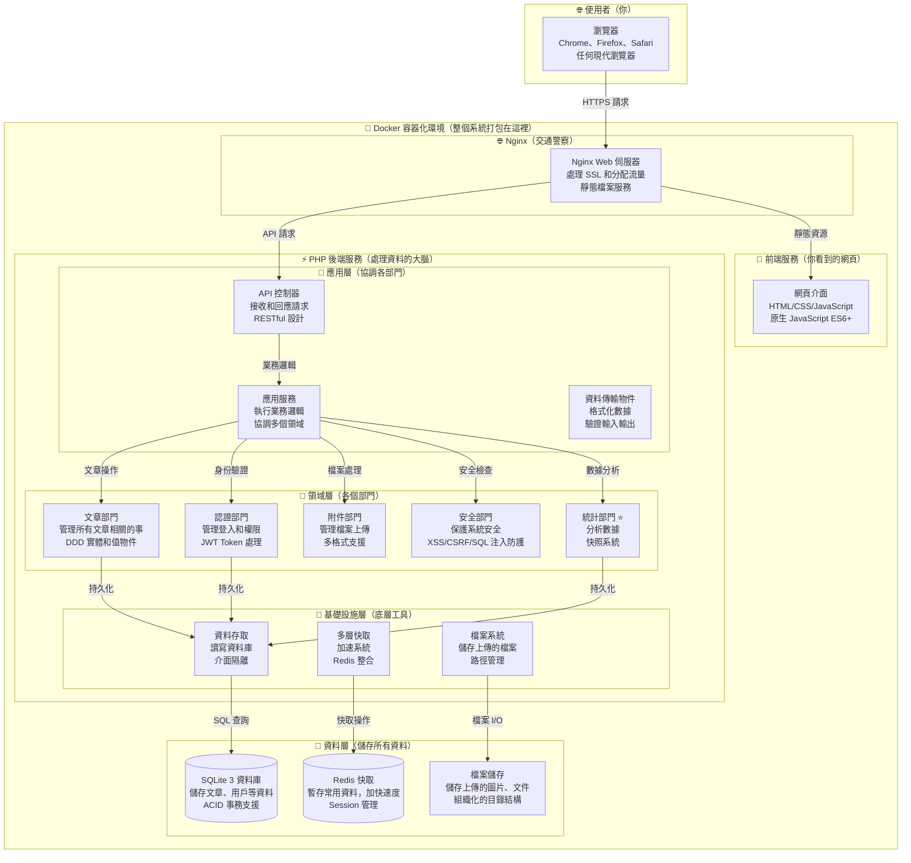

# AlleyNote 公布欄網站

[](https://github.com/cookeyholder/AlleyNote/actions)
[](https://github.com/cookeyholder/AlleyNote/actions)
[](https://www.php.net)
[](https://nodejs.org)
[](LICENSE)
[](#測試流程)
[](docs/domains/shared/ARCHITECTURE_AUDIT.md)
[](docs/domains/statistics/STATISTICS_FEATURE_OVERVIEW.md)

> **✨ 最新版本特色**
>
> 這是一個基於 **DDD（領域驅動設計）架構** 的現代化公告系統。如果你是初學者，別擔心！這個系統雖然使用了先進的技術，但我們會在文件中用淺顯易懂的方式說明一切。
>
> **主要特色**：
> - 📝 完整的內容管理（發布公告、上傳附件）
> - 👥 用戶權限控制（管理員、一般用戶）
> - 🔒 安全防護（防止駭客攻擊）
> - 📊 數據分析（了解誰看了你的公告）

---

## 目錄

- [專案簡介](#專案簡介)
- [核心功能](#核心功能)
- [技術架構](#技術架構)
- [系統需求](#系統需求)
- [快速開始](#快速開始)
- [開發指南](#開發指南)
- [統計模組](#統計模組)
- [測試流程](#測試流程)
- [部署說明](#部署說明)
- [文件資源](#文件資源)
- [授權](#授權)

---

## 專案簡介

### 🤔 AlleyNote 是什麼？

AlleyNote 是一個**公告欄系統**（想像成電子佈告欄），專為**學校、社區、企業**等組織設計。這不只是一個簡單的公告板，而是一個功能完整、安全可靠的內容管理系統。

**詳細說明**：

AlleyNote 提供了一個集中化的平台，讓組織能夠：
- **發布資訊**：公告、新聞、活動通知、政策更新等各種內容
- **管理內容**：完整的編輯、審核、分類、搜尋功能
- **權限控制**：細緻的角色管理，確保資訊安全
- **追蹤效果**：詳細的統計資料，了解資訊傳播效果
- **附件支援**：上傳文件、圖片、PDF 等多種格式檔案

**為什麼選擇 AlleyNote？**

1. **開源免費**：完全開源，無需授權費用
2. **易於部署**：使用 Docker 容器化，幾分鐘就能啟動
3. **安全可靠**：通過 PHPStan Level 10 靜態分析，2190 個測試全部通過
4. **現代架構**：採用 DDD 設計，程式碼清晰易維護
5. **持續更新**：活躍的開發社群，持續改進

**實際應用場景**：

- **學校**：課程公告、考試時間、活動通知、校規更新
- **社區**：住戶通知、活動公告、設施維護公告、繳費提醒
- **企業**：內部公告、政策更新、活動報名、員工福利資訊
- **政府機關**：政策宣導、活動訊息、表單下載、民眾服務資訊

### 👨‍🎓 適合誰使用？

**1. 學校老師和行政人員**
   - 發布作業通知、考試時間表
   - 分享課程資料、教學影片
   - 公告活動資訊、緊急通知
   - 追蹤學生和家長的閱讀狀況

**2. 社區管理員**
   - 張貼社區消息、活動資訊
   - 設施維護通知、停水停電公告
   - 管理費繳納提醒
   - 收集住戶回饋意見

**3. 企業 HR 和管理者**
   - 公司政策、規章制度公告
   - 員工福利、活動報名資訊
   - 內部培訓通知
   - 緊急狀況通報

**4. 開發者和學習者**
   - 學習現代 PHP 8.4 開發實踐
   - 理解 DDD（領域驅動設計）架構
   - 研究高品質程式碼的寫法
   - 貢獻開源專案，累積經驗

### 🎯 設計理念（給初學者的詳細說明）

我們使用了一些專業的技術概念，但不用擔心，這裡用最簡單的方式解釋：

#### 1. **領域驅動設計（Domain-Driven Design, DDD）**

**什麼是 DDD？**
想像一個大公司，如果所有部門都混在一起工作會很亂。所以我們把公司分成：行銷部、財務部、人資部等，每個部門各司其職。

**在 AlleyNote 中的應用：**
- **文章部門（Post Domain）**：負責所有跟文章相關的事
  - 建立文章、編輯文章、刪除文章
  - 管理文章狀態（草稿、已發布、已下架）
  - 處理置頂、分類等功能

- **用戶部門（Auth Domain）**：負責所有跟用戶相關的事
  - 註冊、登入、登出
  - 權限管理（管理員、一般用戶）
  - 密碼重設、個人資料管理

- **統計部門（Statistics Domain）**：負責所有數據分析
  - 計算瀏覽次數、熱門文章
  - 產生統計報表、趨勢分析
  - 建立每日/每週/每月快照

- **安全部門（Security Domain）**：負責系統安全
  - 防止駭客攻擊（XSS、CSRF、SQL Injection）
  - IP 黑白名單管理
  - 異常行為偵測

**好處是什麼？**
- 程式碼更清楚，容易理解
- 要修改某個功能時，只需要改對應的部門
- 不同部門可以由不同開發者同時開發
- 新加入的開發者更容易上手

#### 2. **前後端分離架構**

**什麼是前後端分離？**
就像餐廳分成「外場」和「廚房」：

- **前端（Frontend）= 外場**
  - 這是客人（用戶）看到和接觸的部分
  - 負責顯示漂亮的界面
  - 處理用戶的點擊、輸入
  - 就像餐廳的裝潢、菜單、服務生

- **後端（Backend）= 廚房**
  - 這是客人看不到的部分
  - 負責處理複雜的邏輯和資料
  - 儲存和管理所有資料
  - 就像廚房的廚師、食材、烹飪過程

**在 AlleyNote 中：**
- **前端**使用純 HTML/CSS/JavaScript，負責：
  - 顯示公告列表
  - 提供搜尋和篩選功能
  - 文章編輯器界面
  - 統計圖表視覺化

- **後端**使用 PHP 8.4，負責：
  - 驗證用戶身份
  - 儲存文章到資料庫
  - 計算統計數據
  - 確保資料安全

**好處是什麼？**
- 前端和後端可以分別開發和測試
- 未來可以輕鬆做手機 App（只需要改前端）
- 可以換不同的前端技術（React、Vue 等）
- 後端可以同時服務網頁和 App

#### 3. **容器化部署（Docker）**

**什麼是 Docker？**
想像你要送朋友一個完整的「迷你餐廳」，不只有食材，連廚具、爐子、調味料都打包好。朋友收到後，只要打開就能立刻開始煮菜，不用自己準備工具。

**Docker 做的就是這件事：**
- 把整個 AlleyNote 系統打包成一個「容器」
- 包含 PHP、Nginx、Redis、所有套件
- 在任何支援 Docker 的 Linux 伺服器上都能運行
- 不用擔心「在我電腦上可以跑啊」的問題

**具體來說：**
- **alleynote_web 容器**：運行 PHP 程式，處理業務邏輯
- **alleynote_nginx 容器**：Web 伺服器，處理 HTTP 請求
- **alleynote_redis 容器**：快取系統，加速資料存取
- **alleynote_certbot 容器**：自動管理 SSL 憑證（HTTPS）

**好處是什麼？**
- 部署超級簡單：一個命令就能啟動整個系統
- 環境一致：開發環境和正式環境完全相同
- 易於維護：要更新只需要拉取新的容器映像
- 資源隔離：每個容器獨立運行，互不影響

#### 4. **數據驅動決策**

**什麼是數據驅動？**
不是憑感覺做決定，而是根據實際數據來決策。就像店長不是猜哪個商品賣得好，而是看銷售報表。

**AlleyNote 收集的數據：**
- **瀏覽數據**：哪些文章被看最多次？
- **時間數據**：什麼時段使用者最活躍？
- **來源數據**：使用者從哪裡來（手動輸入、RSS訂閱等）？
- **行為數據**：使用者喜歡看什麼類型的內容？

**這些數據能幫助你：**
- 了解哪些公告最受關注
- 決定什麼時間發布公告效果最好
- 知道哪些內容需要改進
- 評估溝通策略是否有效

**隱私保護：**
- 只記錄必要的統計數據
- 不記錄個人隱私資訊
- 符合 GDPR 等隱私法規
- 管理員可以控制記錄的詳細程度

---

## 核心功能

### 📝 內容管理（發布公告）

**你可以做什麼**：
- **發布文章**：撰寫公告、新聞、通知
- **編輯管理**：隨時修改、刪除已發布的內容
- **分類標籤**：用標籤整理文章，方便查找
- **置頂功能**：重要公告可以置頂顯示
- **上傳附件**：支援圖片、PDF、文件等多種格式
- **內容審核**：管理員可以審核內容，確保品質

**初學者提示**：就像在 Facebook 發文，但功能更專業！

### 👥 用戶系統（管理使用者）

**認證授權**（簡單說就是「登入和權限」）：
- **JWT Token**：一種安全的登入方式（不用擔心密碼外洩）
- **角色權限**：分成管理員和一般用戶
  - 管理員：可以做任何事
  - 一般用戶：只能看和發布
- **會話管理**：記住你的登入狀態

**用戶管理**：
- **註冊審核**：新用戶需要管理員同意才能使用
- **資料維護**：管理用戶的個人資料
- **狀態控制**：可以停用違規用戶

**活動記錄**（誰做了什麼）：
- 記錄 21 種不同的行為（登入、發文、修改等）
- 異常檢測（發現可疑行為會警告）
- 審計追踪（事後可以查詢誰做了什麼）

**初學者提示**：想像成一個有保全系統的辦公大樓，每個人都有門禁卡和權限。

### 🔒 安全控制（保護系統）

**存取控制**：
- **IP 黑白名單**：可以封鎖特定 IP 位址
- **地理位置限制**：限制只有特定國家可以訪問

**攻擊防護**：
- **CSRF 防護**：防止偽造請求攻擊
- **XSS 防護**：防止惡意腳本注入
- **SQL Injection 防護**：防止資料庫被攻擊

**安全監控**：
- **異常行為檢測**：系統會自動偵測可疑活動
- **自動封禁**：發現攻擊會自動封鎖

**初學者提示**：這些是網站的「保全系統」，自動幫你防禦各種網路攻擊。

### 📊 統計模組 ⭐（了解數據）

這是系統的「分析大腦」，幫你理解使用情況。

**多維度分析**：
- **內容統計**：哪些文章最受歡迎？
- **用戶統計**：有多少活躍用戶？
- **行為統計**：大家都在看什麼？

**趨勢預測**：
- **時間序列分析**：找出瀏覽量的變化趨勢
- **增長預測**：預測未來的使用量

**視覺化儀表板**：
- **實時數據**：立即看到最新數據
- **互動圖表**：漂亮的圖表，一目瞭然

**快照系統**：
- 每日/每週/每月自動儲存統計資料
- 可以回顧歷史數據

**初學者提示**：就像 Google Analytics，但是專為你的公告系統設計！

📖 **想了解更多？** 請閱讀：[統計功能詳細說明](docs/domains/statistics/STATISTICS_FEATURE_OVERVIEW.md)

---

## 技術架構

### 🤓 給初學者的說明

不懂技術也沒關係！這裡用簡單的方式說明系統是怎麼運作的。

### 🏗️ 系統架構圖

下面的圖表顯示系統的各個部分如何協同工作（就像公司的組織架構圖）：



**圖解說明：**

1. **使用者層**：任何人用瀏覽器訪問
2. **Nginx 層**：負責接收請求並分流
   - 靜態檔案直接回傳（快）
   - API 請求轉給 PHP（需要處理）
3. **前端層**：提供使用者界面
4. **PHP 後端**：分三層處理邏輯
   - 應用層：接收請求，協調各部門
   - 領域層：核心業務邏輯
   - 基礎設施層：技術實作細節
5. **資料層**：儲存所有資料

### 🛠️ 技術棧（使用的工具）

#### 後端技術（Backend - 伺服器端，處理資料和邏輯）

**1. PHP 8.4.12**
- **這是什麼？** 一種伺服器端程式語言，專門用來處理網站邏輯
- **為什麼選它？**
  - 成熟穩定，有 25+ 年的發展歷史
  - PHP 8.4 是最新版本，速度快、功能強
  - 大量的學習資源和活躍社群
  - WordPress、Facebook 等都使用 PHP
- **在 AlleyNote 中的角色：**
  - 處理所有業務邏輯（發文、登入、權限檢查等）
  - 與資料庫溝通，讀寫資料
  - 產生 API 回應給前端

**2. DDD（領域驅動設計）架構**
- **這是什麼？** 一種組織程式碼的方法論
- **為什麼使用？**
  - 讓大型專案的程式碼更清楚易懂
  - 業務邏輯和技術細節分開
  - 方便多人協作開發
  - 容易測試和維護
- **具體實作：**
  - 領域層（Domain）：核心業務邏輯
  - 應用層（Application）：協調各領域
  - 基礎設施層（Infrastructure）：技術實作（資料庫、快取等）

**3. Composer**
- **這是什麼？** PHP 的套件管理工具（類似 npm 對 JavaScript）
- **用途：** 管理 PHP 相依套件，例如：
  - PHPUnit（測試框架）
  - PHPStan（靜態分析工具）
  - PHP CS Fixer（程式碼風格檢查）

#### 前端技術（Frontend - 瀏覽器端，使用者看到的畫面）

**1. 原生 HTML/CSS/JavaScript**
- **這是什麼？** 瀏覽器原生支援的三大核心技術
- **為什麼選擇原生？**
  - 零構建時間，直接在瀏覽器運行
  - 不需要複雜的構建工具和配置
  - 學習曲線平緩，對初學者友善
  - 載入速度快，不需要框架開銷
  - 易於部署，不需要編譯步驟
- **在 AlleyNote 中的角色：**
  - HTML：構建頁面結構
  - CSS：設計視覺樣式和響應式佈局
  - JavaScript (ES6+)：處理互動邏輯和 API 通訊

**2. 原生 JavaScript（ES6+）**
- **這是什麼？** 瀏覽器原生支援的程式語言
- **使用的現代特性：**
  - 模組化（ES Modules）
  - 箭頭函式和解構賦值
  - Promise 和 async/await
  - 類別（Class）和繼承
  - 模板字串
- **在 AlleyNote 中的角色：**
  - 處理使用者互動（點擊、輸入等）
  - 與後端 API 溝通
  - 動態更新頁面內容
  - 表單驗證和資料處理

**3. Fetch API**
- **這是什麼？** 瀏覽器內建的 HTTP 請求 API
- **為什麼選它？**
  - 瀏覽器原生支援，不需要額外套件
  - 基於 Promise，易於使用
  - 現代瀏覽器全面支援
  - 輕量級，無額外依賴
- **在 AlleyNote 中的角色：**
  - 與後端 API 溝通（GET、POST、PUT、DELETE）
  - 處理身份驗證 Token
  - 上傳和下載檔案

**4. 原生 CSS + CSS Variables**

#### 資料庫技術（Database - 儲存資料的地方）

**1. SQLite 3**
- **這是什麼？** 一個嵌入式資料庫
- **為什麼選它？**
  - **零設定**：不需要安裝資料庫伺服器
  - **單檔案**：整個資料庫就是一個檔案
  - **輕量快速**：適合中小型專案（每月百萬次查詢沒問題）
  - **ACID 支援**：確保資料完整性
  - **跨平台**：Linux、Mac、Windows 都能用
- **在 AlleyNote 中儲存：**
  - 用戶資料（帳號、密碼）
  - 文章內容（標題、內容、狀態）
  - 統計數據（瀏覽次數、熱門文章）
  - 系統設定

**擴展性說明：**
- 對於大型部署，可以輕鬆遷移到 PostgreSQL
- 程式碼使用介面隔離，切換資料庫不需要大改
- SQLite 支援：
  - 最多 140 TB 的資料庫大小
  - 數百萬筆資料沒問題
  - 並發讀取（多人同時查詢）

#### 快取技術（Cache - 加速系統回應）

**1. Redis (Alpine Linux版本)**
- **這是什麼？** 記憶體資料庫和快取系統
- **為什麼需要快取？**
  - 減少資料庫查詢，提升速度 10-100 倍
  - 降低伺服器負擔
  - 改善使用者體驗（頁面秒開）
- **在 AlleyNote 中快取：**
  - 熱門文章列表（每 5 分鐘更新）
  - 使用者 Session 資料
  - 統計數據（避免重複計算）
  - API 回應結果
- **Redis 特色：**
  - 超快速度（100,000+ 次查詢/秒）
  - 支援多種資料結構（字串、列表、集合、雜湊）
  - 資料持久化（可選）
  - 主從複製和叢集支援

#### 容器化技術（Containerization - 打包和部署）

**1. Docker Engine**
- **這是什麼？** 容器化平台
- **重要說明：**
  - ⚠️ **本專案僅支援 Linux 環境（Debian/Ubuntu）**
  - ⚠️ **不支援 Docker Desktop（Mac/Windows）**
  - ⚠️ **必須使用原生 Docker Engine**
- **為什麼這樣限制？**
  - 生產環境通常是 Linux 伺服器
  - Docker Desktop 有授權和效能問題
  - Linux 原生 Docker 更穩定可靠
  - 避免開發和生產環境差異
- **使用的容器：**
  - **alleynote_web**：PHP 8.4 + PHP-FPM
  - **alleynote_nginx**：Nginx Web 伺服器
  - **alleynote_redis**：Redis 快取服務
  - **alleynote_certbot**：SSL 憑證管理（可選）

**2. Docker Compose v2.39.2+**
- **這是什麼？** 管理多容器應用的工具
- **為什麼需要？**
  - 一個命令啟動所有服務
  - 定義容器間的網路和依賴關係
  - 方便的環境變數管理
  - 開發和生產環境一致
- **docker-compose.yml 定義：**
  - 服務配置（web、nginx、redis）
  - 網路設定（內部通訊）
  - 資料卷掛載（資料持久化）
  - 環境變數

#### Web 伺服器（Web Server - 網站的入口）

**1. Nginx (Alpine Linux版本)**
- **這是什麼？** 高效能的 Web 伺服器和反向代理
- **為什麼選 Nginx？**
  - 處理靜態檔案超快（圖片、CSS、JavaScript）
  - 支援數萬併發連線
  - 記憶體使用少
  - 穩定可靠（許多大型網站使用）
- **在 AlleyNote 中的角色：**
  - 接收所有 HTTP/HTTPS 請求
  - 提供靜態檔案（前端代碼、圖片）
  - 反向代理到 PHP（處理動態請求）
  - SSL/TLS 終止（HTTPS 加密）
  - 速率限制（防止攻擊）
  - GZIP 壓縮（減少傳輸量）

#### 開發工具（Development Tools）

**1. PHPUnit 11.5.34**
- **這是什麼？** PHP 的測試框架
- **為什麼重要？**
  - 確保程式碼品質
  - 自動化測試，節省時間
  - 防止改 A 壞 B 的問題
- **AlleyNote 的測試：**
  - 2190 個測試案例
  - 9300+ 個斷言
  - 100% 通過率
  - 涵蓋單元、整合、安全測試

**2. PHPStan (Level 10)**
- **這是什麼？** PHP 靜態分析工具
- **為什麼重要？**
  - 在執行前就找出潛在錯誤
  - 檢查型別錯誤
  - 發現未使用的變數
  - 確保程式碼符合最佳實踐
- **Level 10 是什麼？**
  - 最嚴格的檢查等級
  - 0 個錯誤通過
  - 保證程式碼品質

**3. PHP CS Fixer**
- **這是什麼？** 程式碼風格檢查和修復工具
- **為什麼需要？**
  - 統一團隊的程式碼風格
  - 自動修復格式問題
  - 提升程式碼可讀性
- **檢查內容：**
  - 縮排和空格
  - 命名規範
  - 註解格式
  - PSR-12 標準


**建議開發環境：**

- **最佳選擇**：Ubuntu 22.04/24.04 LTS 或 Debian 12
- **替代方案**：
  - Windows 用戶：使用 WSL2 + Ubuntu
  - Mac 用戶：使用雲端 Linux VM（AWS、GCP、Digital Ocean）

---

### 📁 專案結構（檔案放在哪裡）

**給初學者**：這是整個專案的資料夾結構，就像公司的檔案櫃一樣，每個資料夾都有特定用途。

```
AlleyNote/
├── 🎨 frontend/                    # 前端應用程式（純 HTML/JS/CSS）
│   ├── index.html                  # 主頁面入口
│   ├── js/                         # JavaScript ES6 模組
│   │   ├── main.js                # 應用程式入口
│   │   ├── api/                   # API 客戶端
│   │   │   ├── client.js         # HTTP 客戶端
│   │   │   ├── auth.js           # 認證 API
│   │   │   ├── posts.js          # 文章 API
│   │   │   └── ...
│   │   ├── components/            # UI 組件
│   │   │   ├── Modal.js          # 對話框
│   │   │   └── Loading.js        # 載入動畫
│   │   ├── pages/                 # 頁面模組
│   │   │   ├── public/           # 公開頁面
│   │   │   │   ├── home.js       # 首頁
│   │   │   │   └── login.js      # 登入
│   │   │   └── admin/            # 管理後台
│   │   │       └── dashboard.js  # 儀表板
│   │   └── utils/                 # 工具函式
│   │       ├── router.js         # 前端路由
│   │       ├── toast.js          # 通知系統
│   │       └── validator.js      # 表單驗證
│   ├── css/                        # 樣式表
│   │   └── main.css               # 主要樣式
│   └── assets/                     # 靜態資源
│       ├── images/                # 圖片
│       └── icons/                 # 圖示
│
├── ⚡ backend/                     # 後端 API（資料處理）
│   ├── app/                        # DDD 架構程式碼
│   │   ├── Domains/               # 領域層（各個部門）
│   │   ├── Application/           # 應用層（協調部門）
│   │   ├── Infrastructure/        # 基礎設施層（工具）
│   │   └── Shared/                # 共用組件（大家都用的）
│   ├── config/                    # 配置檔案（設定）
│   ├── database/                  # 資料庫相關
│   ├── tests/                     # 測試套件（確保品質）
│   └── composer.json              # PHP 依賴清單
│
├── 📖 docs/                       # 64+ 份文件
│   ├── statistics/                # 統計功能文件
│   ├── ddd/                       # DDD 架構文件
│   ├── reports/                   # 各種報告
│   └── ...                        # 其他文件
│
├── 🐳 docker/                     # Docker 容器配置
│   ├── nginx/                     # Nginx 設定
│   ├── php/                       # PHP 環境設定
│   └── redis/                     # Redis 設定
│
├── 🛠️ scripts/                    # 維運腳本（自動化工具）
│   ├── Analysis/                  # 分析工具
│   └── ...                        # 其他腳本
│
├── docker-compose.yml             # Docker 服務定義（很重要！）
├── .env.example                   # 環境變數範例
└── README.md                      # 你正在讀的這份文件 😊
```

**重要檔案說明**：
- `docker-compose.yml`：定義整個系統如何啟動
- `.env`：環境變數設定檔（從 .env.example 複製）
- `backend/composer.json`：PHP 套件清單
- `frontend/index.html`：前端入口頁面
- `frontend/js/main.js`：前端應用程式入口

---

## 系統需求

### 🖥️ 支援的作業系統

1. **Ubuntu 22.04 LTS（Jammy Jellyfish）** - 最推薦
   - 長期支援到 2027 年
   - 穩定且廣泛使用
   - 大量的社群支援和教學資源
   - Docker 官方完全支援

2. **Ubuntu 24.04 LTS（Noble Numbat）** - 最新版
   - 長期支援到 2029 年
   - 最新的核心和套件
   - 更好的硬體支援
   - 適合新硬體

3. **Debian 12（Bookworm）** - 伺服器首選
   - 超穩定，適合生產環境
   - 長期支援
   - 資源佔用少
   - 企業級品質

### 🤔 我需要準備什麼？

#### 1. Linux 伺服器或電腦

**最低硬體需求**：
- **CPU**: 2 核心（建議 4 核心）
- **記憶體（RAM）**: 最少 2GB（建議 4GB 或以上）
- **儲存空間**: 最少 10GB 可用空間
- **網路**: 穩定的網際網路連線（初次安裝需要下載套件）

**推薦硬體配置**：
- **CPU**: 4 核心或以上
- **記憶體**: 8GB 或以上
- **儲存**: 50GB SSD
- **網路**: 100Mbps 或以上

#### 2. Docker Engine（原生版本）

**版本需求**：
- Docker Engine: 28.3.3 或更新
- Docker Compose: v2.39.2 或更新

**安裝方法（Ubuntu/Debian）**：

```bash
# 1. 更新系統套件
sudo apt update && sudo apt upgrade -y

# 2. 安裝必要工具
sudo apt install -y apt-transport-https ca-certificates curl software-properties-common

# 3. 新增 Docker 官方 GPG 金鑰
curl -fsSL https://download.docker.com/linux/ubuntu/gpg | sudo gpg --dearmor -o /usr/share/keyrings/docker-archive-keyring.gpg

# 4. 新增 Docker 套件庫
echo "deb [arch=$(dpkg --print-architecture) signed-by=/usr/share/keyrings/docker-archive-keyring.gpg] https://download.docker.com/linux/ubuntu $(lsb_release -cs) stable" | sudo tee /etc/apt/sources.list.d/docker.list > /dev/null

# 5. 安裝 Docker Engine
sudo apt update
sudo apt install -y docker-ce docker-ce-cli containerd.io docker-buildx-plugin docker-compose-plugin

# 6. 將當前用戶加入 docker 群組
sudo usermod -aG docker $USER

# 7. 啟動 Docker 服務
sudo systemctl enable docker
sudo systemctl start docker

# 8. 登出再登入讓群組變更生效
```

**安裝完成後的驗證**：

```bash
# 檢查 Docker 版本
docker --version

# 檢查 Docker Compose 版本
docker compose version

# 檢查 Docker 是否正在運行
docker ps

# 測試 Docker 是否正常工作
docker run hello-world
```

#### 3. Git（版本控制）

```bash
# Ubuntu/Debian
sudo apt install -y git

# 驗證安裝
git --version
```

#### 4. 基本 Linux 知識

**你需要會的基本命令**：

```bash
# 切換目錄
cd /path/to/directory

# 列出檔案
ls -la

# 建立目錄
mkdir my-directory

# 複製檔案
cp source.txt destination.txt

# 移動/重新命名檔案
mv old-name.txt new-name.txt

# 刪除檔案
rm file.txt

# 查看檔案內容
cat file.txt

# 編輯檔案
nano file.txt  # 或 vim file.txt

# 查看執行中的程序
ps aux

# 檢查磁碟空間
df -h

# 檢查記憶體使用
free -h
```

**不熟悉 Linux？**
建議先花 1-2 小時學習基礎：
- [Linux 基礎教學](https://ubuntu.com/tutorials/command-line-for-beginners)
- [鳥哥的 Linux 私房菜](http://linux.vbird.org/)

### 🔧 開發需求（如果你要修改程式碼）

如果你想要開發新功能或修改程式碼，除了上述基本需求外，還需要：

**1. PHP 8.4.12+**
- ✅ Docker 容器裡已經包含，不用另外安裝！

**2. Composer 2.0+**
- ✅ Docker 容器裡已經包含！
- 管理 PHP 套件的工具（類似 npm 對 JavaScript）

**3. ~~Node.js 18.0+~~**（不再需要）
- ❌ 前端已改為純 HTML/JavaScript/CSS，不需要 Node.js
- ❌ 不需要 npm、Vite 等構建工具
- ✅ 前端直接透過 nginx 提供靜態檔案服務

**4. 程式碼編輯器（推薦）**：

- **Visual Studio Code** - 免費、功能強大
  ```bash
  # 下載並安裝
  wget -qO- https://packages.microsoft.com/keys/microsoft.asc | gpg --dearmor > packages.microsoft.gpg
  sudo install -D -o root -g root -m 644 packages.microsoft.gpg /etc/apt/keyrings/packages.microsoft.gpg
  sudo sh -c 'echo "deb [arch=amd64,arm64,armhf signed-by=/etc/apt/keyrings/packages.microsoft.gpg] https://packages.microsoft.com/repos/code stable main" > /etc/apt/sources.list.d/vscode.list'
  sudo apt update
  sudo apt install -y code
  ```

- **PhpStorm** - 專業的 PHP IDE（付費）
  - 下載：[JetBrains PhpStorm](https://www.jetbrains.com/phpstorm/)

### ✅ 完整環境檢查清單

在開始安裝 AlleyNote 之前，確保以下所有項目都打勾：

```bash
# 執行這個腳本來檢查你的環境
cat > check-requirements.sh << 'EOF'
#!/bin/bash
echo "=== AlleyNote 系統需求檢查 ==="
echo ""

# 檢查作業系統
echo "1. 檢查作業系統..."
if [ -f /etc/os-release ]; then
    source /etc/os-release
    if [[ "$ID" == "ubuntu" ]] || [[ "$ID" == "debian" ]]; then
        echo "   ✅ 作業系統: $PRETTY_NAME (支援)"
    else
        echo "   ❌ 作業系統: $PRETTY_NAME (不支援，僅支援 Ubuntu/Debian)"
    fi
else
    echo "   ❌ 無法識別作業系統"
fi

# 檢查 Docker
echo "2. 檢查 Docker..."
if command -v docker &> /dev/null; then
    docker_version=$(docker --version | awk '{print $3}' | sed 's/,//')
    echo "   ✅ Docker 版本: $docker_version"
else
    echo "   ❌ Docker 未安裝"
fi

# 檢查 Docker Compose
echo "3. 檢查 Docker Compose..."
if docker compose version &> /dev/null; then
    compose_version=$(docker compose version | awk '{print $4}')
    echo "   ✅ Docker Compose 版本: $compose_version"
else
    echo "   ❌ Docker Compose 未安裝"
fi

# 檢查 Docker 是否運行
echo "4. 檢查 Docker 服務..."
if systemctl is-active --quiet docker; then
    echo "   ✅ Docker 服務正在運行"
else
    echo "   ❌ Docker 服務未運行"
fi

# 檢查用戶是否在 docker 群組
echo "5. 檢查 Docker 權限..."
if groups | grep -q docker; then
    echo "   ✅ 用戶在 docker 群組中"
else
    echo "   ⚠️  用戶不在 docker 群組中（需要 sudo 或重新登入）"
fi

# 檢查 Git
echo "6. 檢查 Git..."
if command -v git &> /dev/null; then
    git_version=$(git --version | awk '{print $3}')
    echo "   ✅ Git 版本: $git_version"
else
    echo "   ❌ Git 未安裝"
fi

# 檢查系統資源
echo "7. 檢查系統資源..."
total_ram=$(free -g | awk '/^Mem:/{print $2}')
if [ "$total_ram" -ge 2 ]; then
    echo "   ✅ 記憶體: ${total_ram}GB (足夠)"
else
    echo "   ⚠️  記憶體: ${total_ram}GB (建議至少 2GB)"
fi

total_disk=$(df -BG / | awk 'NR==2 {print $4}' | sed 's/G//')
if [ "$total_disk" -ge 10 ]; then
    echo "   ✅ 可用空間: ${total_disk}GB (足夠)"
else
    echo "   ⚠️  可用空間: ${total_disk}GB (建議至少 10GB)"
fi

echo ""
echo "=== 檢查完成 ==="
EOF

chmod +x check-requirements.sh
./check-requirements.sh
```

**所有項目都是 ✅ 嗎？**
- 是：太好了！你可以繼續進行快速開始步驟
- 否：請根據 ❌ 或 ⚠️  的項目進行安裝或修正

**需要幫助？**
- 詳細的故障排除：[系統需求文件](docs/guides/admin/SYSTEM_REQUIREMENTS.md)
- 提問：[GitHub Issues](https://github.com/cookeyholder/AlleyNote/issues)

---
sudo systemctl start docker

# 8. 登出再登入（或重啟）讓群組變更生效
```

**安裝完成後的驗證**：

```bash
# 檢查 Docker 版本（應該顯示版本號）
docker --version
# 預期輸出：Docker version 28.3.3, build...

# 檢查 Docker Compose 版本
docker compose version
# 預期輸出：Docker Compose version v2.39.2

# 檢查 Docker 是否正在運行
docker ps
# 應該顯示一個表格（即使是空的）

# 測試 Docker 是否正常工作
docker run hello-world
# 應該顯示 "Hello from Docker!" 訊息
```

#### 3. Git（版本控制）

**Git 是什麼？**
用來下載和管理專案原始碼的工具。

**安裝方法**：

```bash
# Ubuntu/Debian
sudo apt install -y git

# 驗證安裝
git --version
# 預期輸出：git version 2.x.x
```

#### 4. 基本 Linux 知識

**你需要會的基本命令**：

```bash
# 切換目錄
cd /path/to/directory

# 列出檔案
ls -la

# 建立目錄
mkdir my-directory

# 複製檔案
cp source.txt destination.txt

# 移動/重新命名檔案
mv old-name.txt new-name.txt

# 刪除檔案
rm file.txt

# 查看檔案內容
cat file.txt

# 編輯檔案
nano file.txt  # 或 vim file.txt

# 查看執行中的程序
ps aux

# 檢查磁碟空間
df -h

# 檢查記憶體使用
free -h
```

**不熟悉 Linux？**
建議先花 1-2 小時學習基礎：
- [Linux 基礎教學](https://ubuntu.com/tutorials/command-line-for-beginners)
- [鳥哥的 Linux 私房菜](http://linux.vbird.org/)

### 🔧 開發需求（如果你要修改程式碼）

如果你想要開發新功能或修改程式碼，除了上述基本需求外，還需要：

**1. PHP 8.4.12+**
- ✅ Docker 容器裡已經包含，不用另外安裝！
- 如果想在本機測試：
  ```bash
  sudo apt install -y php8.4-cli php8.4-fpm php8.4-sqlite3 php8.4-redis php8.4-xml php8.4-mbstring
  ```

**2. Composer 2.0+**
- ✅ Docker 容器裡已經包含！
- 管理 PHP 套件的工具（類似 npm 對 JavaScript）

**3. Node.js 18.0+**（前端建構用）
- 用來執行 Vite 建構工具
- 安裝方法：
  ```bash
  # 使用 NodeSource 套件庫
  curl -fsSL https://deb.nodesource.com/setup_18.x | sudo -E bash -
  sudo apt install -y nodejs

  # 驗證安裝
  node --version  # 應顯示 v18.x.x
  npm --version   # 應顯示 9.x.x 或更新
  ```

**4. 程式碼編輯器（推薦）**：

- **Visual Studio Code** - 免費、功能強大
  ```bash
  # 下載並安裝
  wget -qO- https://packages.microsoft.com/keys/microsoft.asc | gpg --dearmor > packages.microsoft.gpg
  sudo install -D -o root -g root -m 644 packages.microsoft.gpg /etc/apt/keyrings/packages.microsoft.gpg
  sudo sh -c 'echo "deb [arch=amd64,arm64,armhf signed-by=/etc/apt/keyrings/packages.microsoft.gpg] https://packages.microsoft.com/repos/code stable main" > /etc/apt/sources.list.d/vscode.list'
  sudo apt update
  sudo apt install -y code
  ```

- **PhpStorm** - 專業的 PHP IDE（付費）
  - 下載：[JetBrains PhpStorm](https://www.jetbrains.com/phpstorm/)

### ✅ 完整環境檢查清單

在開始安裝 AlleyNote 之前，確保以下所有項目都打勾：

```bash
# 執行這個腳本來檢查你的環境
cat > check-requirements.sh << 'EOF'
#!/bin/bash
echo "=== AlleyNote 系統需求檢查 ==="
echo ""

# 檢查作業系統
echo "1. 檢查作業系統..."
if [ -f /etc/os-release ]; then
    source /etc/os-release
    if [[ "$ID" == "ubuntu" ]] || [[ "$ID" == "debian" ]]; then
        echo "   ✅ 作業系統: $PRETTY_NAME (支援)"
    else
        echo "   ❌ 作業系統: $PRETTY_NAME (不支援，僅支援 Ubuntu/Debian)"
    fi
else
    echo "   ❌ 無法識別作業系統"
fi

# 檢查 Docker
echo "2. 檢查 Docker..."
if command -v docker &> /dev/null; then
    docker_version=$(docker --version | awk '{print $3}' | sed 's/,//')
    echo "   ✅ Docker 版本: $docker_version"
else
    echo "   ❌ Docker 未安裝"
fi

# 檢查 Docker Compose
echo "3. 檢查 Docker Compose..."
if docker compose version &> /dev/null; then
    compose_version=$(docker compose version | awk '{print $4}')
    echo "   ✅ Docker Compose 版本: $compose_version"
else
    echo "   ❌ Docker Compose 未安裝"
fi

# 檢查 Docker 是否運行
echo "4. 檢查 Docker 服務..."
if systemctl is-active --quiet docker; then
    echo "   ✅ Docker 服務正在運行"
else
    echo "   ❌ Docker 服務未運行"
fi

# 檢查用戶是否在 docker 群組
echo "5. 檢查 Docker 權限..."
if groups | grep -q docker; then
    echo "   ✅ 用戶在 docker 群組中"
else
    echo "   ⚠️  用戶不在 docker 群組中（需要 sudo 或重新登入）"
fi

# 檢查 Git
echo "6. 檢查 Git..."
if command -v git &> /dev/null; then
    git_version=$(git --version | awk '{print $3}')
    echo "   ✅ Git 版本: $git_version"
else
    echo "   ❌ Git 未安裝"
fi

# 檢查系統資源
echo "7. 檢查系統資源..."
total_ram=$(free -g | awk '/^Mem:/{print $2}')
if [ "$total_ram" -ge 2 ]; then
    echo "   ✅ 記憶體: ${total_ram}GB (足夠)"
else
    echo "   ⚠️  記憶體: ${total_ram}GB (建議至少 2GB)"
fi

total_disk=$(df -BG / | awk 'NR==2 {print $4}' | sed 's/G//')
if [ "$total_disk" -ge 10 ]; then
    echo "   ✅ 可用空間: ${total_disk}GB (足夠)"
else
    echo "   ⚠️  可用空間: ${total_disk}GB (建議至少 10GB)"
fi

echo ""
echo "=== 檢查完成 ==="
EOF

chmod +x check-requirements.sh
./check-requirements.sh
```

**所有項目都是 ✅ 嗎？**
- 是：太好了！你可以繼續進行快速開始步驟
- 否：請根據 ❌ 或 ⚠️  的項目進行安裝或修正

**需要幫助？**
- 詳細的故障排除：[系統需求文件](docs/guides/admin/SYSTEM_REQUIREMENTS.md)
- 提問：[GitHub Issues](https://github.com/cookeyholder/AlleyNote/issues)

---

## 快速開始

### 🚀 給完全初學者的安裝指南

不用擔心！我們會一步一步帶你完成安裝。整個過程大約需要 **10-15 分鐘**。

### 步驟 1：下載專案

首先，打開終端機（Terminal）或命令提示字元（Command Prompt），然後執行：

```bash
# 下載專案（就像下載一個壓縮檔）
git clone https://github.com/cookeyholder/AlleyNote.git

# 進入專案資料夾
cd AlleyNote
```

**沒有 Git？**
- Mac：已經內建，直接用！
- Windows：下載 [Git for Windows](https://git-scm.com/download/win)
- Linux：`sudo apt-get install git`

### 步驟 2：設定環境變數

環境變數就像是系統的「設定檔」，告訴系統一些重要資訊。

```bash
# 複製範例檔案（就像複製貼上）
cp .env.example .env
```

**這個檔案裡有什麼？**
- 資料庫位置
- 安全金鑰
- 系統設定

**初學者不用改任何東西**，用預設值就可以了！

### 步驟 3：啟動系統 🎉

這是最簡單的一步！只要一個命令：

```bash
# 啟動所有服務（就像按下「開機」按鈕）
docker compose up -d
```

**發生什麼事了？**
Docker 會自動：
1. 下載需要的套件（第一次會比較久，大約 5-10 分鐘）
2. 設定資料庫
3. 啟動網頁伺服器
4. 啟動快取系統

看到 `✓ Container ... Started` 就表示成功了！

### 步驟 4：初始化資料庫

資料庫需要建立一些表格來儲存資料：

```bash
# 建立資料庫結構
docker compose exec web php backend/database/init.php
```

**這會做什麼？**
- 建立用戶表格
- 建立文章表格
- 建立統計表格
- 新增一些測試資料

### 步驟 5：檢查是否成功 ✅

打開瀏覽器，訪問：

- **前端網頁**：http://localhost:3000
- **後端 API**：http://localhost:8080
- **健康檢查**：http://localhost:8080/health

如果看到網頁，恭喜你！系統已經成功啟動了！🎊

### 步驟 6：建立第一個帳號

```bash
# 執行註冊腳本
docker compose exec web php scripts/create-admin.php
```

跟著提示輸入：
- 用戶名稱
- Email
- 密碼

### 常用命令速查表

```bash
# 🟢 啟動系統
docker compose up -d

# 🔴 停止系統
docker compose down

# 📊 查看執行狀態
docker compose ps

# 📝 查看日誌（看看系統在做什麼）
docker compose logs -f

# 🔄 重新啟動
docker compose restart

# 🧹 完全清除並重新開始
docker compose down -v
docker compose up -d
```

### 🆘 遇到問題？

#### 問題 1：Port 已被占用

**錯誤訊息**：`Error: port is already allocated`

**解決方法**：
```bash
# 查看誰占用了 port
# Mac/Linux:
lsof -i :8080

# Windows:
netstat -ano | findstr :8080

# 停止占用 port 的程式，或修改 docker-compose.yml 中的 port 號碼
```

#### 問題 2：Docker 沒有啟動

**錯誤訊息**：`Cannot connect to Docker daemon`

**解決方法**：
- Mac/Windows：打開 Docker Desktop 應用程式
- Linux：`sudo systemctl start docker`

#### 問題 3：下載很慢

**原因**：網路速度或 Docker Hub 在海外

**解決方法**：
- 使用 VPN
- 或等待下載完成（第一次比較久，之後就快了）

#### 更多問題？

查看詳細的故障排除指南：[故障排除文件](docs/guides/admin/TROUBLESHOOTING_GUIDE.md)

### 🎓 下一步學什麼？

恭喜你成功安裝了 AlleyNote！接下來你可以：

1. **管理員**：閱讀 [管理員快速入門](docs/guides/admin/ADMIN_QUICK_START.md)
2. **開發者**：閱讀 [開發者指南](docs/guides/developer/DEVELOPER_GUIDE.md)
3. **了解統計功能**：閱讀 [統計功能總覽](docs/domains/statistics/STATISTICS_FEATURE_OVERVIEW.md)

---

## 開發指南

### 👨‍💻 給開發者的說明

如果你想要修改程式碼或添加新功能，這裡有一些重要資訊。

### 🛠️ 統一腳本管理系統

我們整合了 58+ 個腳本到一個統一的入口點，讓管理更簡單：

```bash
# 查看系統狀態
docker compose exec web php scripts/unified-scripts.php status

# 執行測試
docker compose exec web php scripts/unified-scripts.php test --action=run

# 程式碼修復
docker compose exec web php scripts/unified-scripts.php fix --type=all

# 統計資料重算
docker compose exec web php scripts/unified-scripts.php statistics:recalculation
```

**特色**：
- 統一管理介面
- 使用現代 PHP 8.4 特性
- 遵循 DDD 原則
- 85% 程式碼減少

### 🔧 常用開發命令

```bash
# 進入 PHP 容器（就像「進入」伺服器）
docker compose exec web bash

# 執行 Composer（PHP 套件管理）
docker compose exec web composer install
docker compose exec web composer update

# 執行測試
docker compose exec -T web ./vendor/bin/phpunit

# 程式碼風格檢查
docker compose exec -T web ./vendor/bin/php-cs-fixer fix

# 靜態分析（找出潛在問題）
docker compose exec -T web ./vendor/bin/phpstan analyse

# 完整 CI 檢查（提交前必做！）
docker compose exec -T web composer ci
```

### 📝 開發流程

1. **建立新分支**
   ```bash
   git checkout -b feature/my-new-feature
   ```

2. **寫程式碼**（遵循 DDD 原則）
   - 先寫測試（TDD）
   - 實作功能
   - 確保測試通過

3. **檢查品質**
   ```bash
   docker compose exec -T web composer ci
   ```

4. **提交**
   ```bash
   git add .
   git commit -m "feat: 新增某某功能"
   git push origin feature/my-new-feature
   ```

5. **建立 Pull Request**

**詳細開發指南**：[開發者文件](docs/guides/developer/DEVELOPER_GUIDE.md)


## 測試流程

### 🧪 給初學者的測試說明

**什麼是測試？**
測試就像是「品質檢查」，確保程式碼沒有問題。就像出廠前要檢查產品一樣！

### ✅ 為什麼要測試？

1. **確保功能正確**：避免發布有 bug 的程式碼
2. **防止破壞現有功能**：改A功能不會影響B功能
3. **提升信心**：敢放心修改程式碼
4. **文件化**：測試就是活的使用範例

### 📊 測試統計

我們的系統測試非常完整：
- **總測試數**：2190 個測試
- **總斷言數**：9300+ 個斷言
- **通過率**：100%（全部通過！）
- **測試覆蓋率**：95%+ 的程式碼都有測試

### 🎯 如何執行測試？

**最簡單的方式**（執行所有測試）：
```bash
docker compose exec -T web ./vendor/bin/phpunit
```

**分類執行**（只測試特定部分）：
```bash
# 單元測試（測試單一函式）
docker compose exec -T web ./vendor/bin/phpunit --testsuite Unit

# 整合測試（測試多個組件協作）
docker compose exec -T web ./vendor/bin/phpunit --testsuite Integration

# 安全測試（測試安全機制）
docker compose exec -T web ./vendor/bin/phpunit --testsuite Security
```

**完整 CI 檢查**（提交前必做）：
```bash
# 這會執行：程式碼風格檢查 + 靜態分析 + 所有測試
docker compose exec -T web composer ci
```

### 📖 測試類型說明

**1. 單元測試（Unit Tests）**
- **目的**：測試單一函式或類別
- **範例**：測試密碼驗證函式是否正確
- **數量**：約 1500 個

**2. 整合測試（Integration Tests）**
- **目的**：測試多個組件是否正常協作
- **範例**：測試登入流程（包含驗證、資料庫、JWT）
- **數量**：約 600 個

**3. 安全測試（Security Tests）**
- **目的**：確保系統安全
- **範例**：測試是否能防止 SQL Injection
- **數量**：約 90 個

### 🆘 測試失敗怎麼辦？

1. **看錯誤訊息**：PHPUnit 會告訴你哪裡錯了
2. **檢查你的改動**：是不是改壞了什麼？
3. **參考測試程式碼**：看看測試期望什麼結果
4. **修復後重新測試**：直到全部通過

**更多幫助**：
- [PHPStan 修復報告](docs/archive/reports/quality/PHPSTAN_FIX_REPORT.md) - 靜態分析問題修復
- [零錯誤修復報告](docs/archive/reports/quality/ZERO_ERROR_FIX_REPORT.md) - 達成零錯誤的過程
- [程式碼品質改善計劃](docs/archive/CODE_QUALITY_IMPROVEMENT_PLAN.md) - 整體品質提升策略

---

## 文件資源

### 📚 給不同角色的文件導航

我們準備了 64+ 份詳細文件！不用全看，根據你的角色選擇適合的文件：

### 👨‍💼 如果你是**管理員/營運人員**

**快速入門（必讀）**：
1. [管理員 30 分鐘快速入門](docs/guides/admin/ADMIN_QUICK_START.md) ⭐⭐⭐
2. [系統需求說明](docs/guides/admin/SYSTEM_REQUIREMENTS.md)
3. [部署指南](docs/guides/deployment/DEPLOYMENT.md)

**日常維護**：
- [管理員操作手冊](docs/guides/admin/ADMIN_MANUAL.md) - 完整的管理指南
- [統計操作手冊](docs/domains/statistics/STATISTICS_OPERATIONS_MANUAL.md) - 統計功能管理
- [故障排除指南](docs/guides/admin/TROUBLESHOOTING_GUIDE.md) - 遇到問題看這裡

**安全與備份**：
- [SSL 設定指南](docs/guides/deployment/SSL_DEPLOYMENT_GUIDE.md) - HTTPS 憑證設定
- 備份說明在[管理員手冊](docs/guides/admin/ADMIN_MANUAL.md)的備份章節

### 👨‍💻 如果你是**開發者**

**快速入門（必讀）**：
1. [開發者指南](docs/guides/developer/DEVELOPER_GUIDE.md) ⭐⭐⭐ - 開發環境設定
2. [程式碼品質改善計劃](docs/archive/CODE_QUALITY_IMPROVEMENT_PLAN.md) - 了解程式碼標準
3. [DDD 架構設計](docs/domains/shared/DDD_ARCHITECTURE_DESIGN.md) - 理解系統架構

**API 開發**：
- [API 文件](docs/guides/developer/API_DOCUMENTATION.md) - 完整的 API 規格
- [路由系統指南](docs/domains/shared/ROUTING_SYSTEM_GUIDE.md) - 路由設計
- [DI 容器指南](docs/guides/developer/DI_CONTAINER_GUIDE.md) - 依賴注入

**進階主題**：
- [驗證器指南](docs/guides/developer/VALIDATOR_GUIDE.md) - 29 種驗證規則
- [快取標籤系統](docs/domains/shared/CACHE_TAGGING_SYSTEM_GUIDE.md) - 快取管理
- [使用者活動記錄](docs/domains/auth/USER_ACTIVITY_LOGGING_ARCHITECTURE.md) - 行為追蹤

**測試與品質**：
- [程式碼品質改善計劃](docs/archive/CODE_QUALITY_IMPROVEMENT_PLAN.md) - 品質提升策略
- [PHPStan 修復報告](docs/archive/reports/quality/PHPSTAN_FIX_REPORT.md) - 靜態分析
- [綜合品質檢查報告](docs/archive/COMPREHENSIVE_QUALITY_CHECK_REPORT.md) - 完整品質檢查

### 📊 如果你想了解**統計功能**

**統計模組文件**（8 份）：
1. [統計功能總覽](docs/domains/statistics/STATISTICS_FEATURE_OVERVIEW.md) ⭐ - 先看這個！
2. [統計功能規格書](docs/domains/statistics/STATISTICS_FEATURE_SPECIFICATION.md) - 詳細規格
3. [統計操作手冊](docs/domains/statistics/STATISTICS_OPERATIONS_MANUAL.md) - 如何使用
4. [統計效能報告](docs/archive/STATISTICS_PERFORMANCE_REPORT.md) - 效能分析
5. [統計資料庫遷移](docs/domains/statistics/STATISTICS_DATABASE_MIGRATION_GUIDE.md) - 資料庫設定
6. [統計領域分析](docs/domains/statistics/STATISTICS_DOMAIN_ANALYSIS.md) - 領域設計
7. [統計重算指南](docs/domains/statistics/STATISTICS_RECALCULATION_GUIDE.md) - 資料重算
8. [統計 TODO](docs/archive/STATISTICS_FEATURE_TODO.md) - 開發記錄

### 🏗️ 如果你想深入理解**系統架構**

**架構文件**：
- [架構審計報告](docs/domains/shared/ARCHITECTURE_AUDIT.md) - 完整架構分析
- [DDD 架構設計](docs/domains/shared/DDD_ARCHITECTURE_DESIGN.md) - 領域驅動設計
- [DDD 值物件總結](docs/archive/reports/completion/DDD_VALUE_OBJECTS_SUMMARY.md) - 值物件實作
- [程式碼品質改善執行報告](docs/archive/reports/CODE_QUALITY_IMPROVEMENT_EXECUTION_REPORT.md) - 品質改善記錄

### 📁 完整文件列表

**按目錄分類**：
- `docs/` - 主要文件（35+ 份）
- `docs/statistics/` - 統計模組文件（8 份）
- `docs/reports/` - 各種報告和完成總結
  - `reports/completion/` - 專案完成報告
  - `reports/quality/` - 品質報告
  - `reports/architecture/` - 架構報告
- `docs/routing/` - 路由系統文件（5 份）
- `docs/migration/` - 遷移文件

**文件索引**：完整列表請看 [文件資源](#文件資源) 章節底部

### 💡 文件閱讀建議

**初學者**：
1. 先看對應角色的「必讀」文件
2. 遇到問題再查相關文件
3. 不要試圖一次看完所有文件

**開發者**：
1. 先理解 DDD 架構
2. 熟悉開發流程
3. 需要時查閱 API 文件

**進階使用**：
- 所有文件都使用 Markdown 格式
- 可以用任何文字編輯器開啟
- GitHub 上可以直接閱讀

---

---
            PostEntity[文章實體]
            PostVO[文章值物件]
            PostService[文章服務]
            PostRepository[文章倉庫介面]
        end

        subgraph "🔐 認證領域"
            AuthEntity[使用者實體]
            AuthVO[認證值物件]
            AuthService[認證服務]
            AuthRepository[認證倉庫介面]
        end

        subgraph "📎 附件領域"
            AttachmentEntity[附件實體]
            AttachmentVO[附件值物件]
            AttachmentService[附件服務]
            AttachmentRepository[附件倉庫介面]
        end

        subgraph "🛡️ 安全領域"
            SecurityEntity[安全實體]
            SecurityVO[安全值物件]
            SecurityService[安全服務]
            SecurityRepository[安全倉庫介面]
        end
    end

    subgraph "🔧 基礎設施層 (Infrastructure Layer)"
        subgraph "💾 資料持久化"
            PostRepoImpl[文章倉庫實作]
            AuthRepoImpl[認證倉庫實作]
            AttachmentRepoImpl[附件倉庫實作]
            SecurityRepoImpl[安全倉庫實作]
        end

        subgraph "⚡ 快取系統"
            CacheManager[快取管理器]
            CacheKeys[快取金鑰]
            TagSystem[標籤系統]
        end

        subgraph "📁 檔案系統"
            FileStorage[檔案儲存]
            UploadHandler[上傳處理器]
        end
    end

    subgraph "🛠️ 共用層 (Shared Layer)"
        subgraph "✅ 驗證系統"
            Validators[29種驗證規則]
            ValidationResult[驗證結果]
        end

        subgraph "⚠️ 例外處理"
            DomainExceptions[領域例外]
            AppExceptions[應用例外]
            InfraExceptions[基礎設施例外]
        end

        subgraph "🔧 工具類別"
            Helpers[輔助函式]
            Constants[常數定義]
            Enums[列舉型別]
        end
    end

    subgraph "💾 資料儲存層"
        SQLite[(SQLite 資料庫)]
        FileSystem[(檔案系統)]
    end

    %% 連接關係
    HTTP --> WebCtrl
    HTTP --> ApiCtrl
    CLI --> SecurityCtrl

    WebCtrl --> AppServices
    ApiCtrl --> AppServices
    SecurityCtrl --> AppServices

    AppServices --> DTOs
    DTOs --> Validators

    AppServices --> PostService
    AppServices --> AuthService
    AppServices --> AttachmentService
    AppServices --> SecurityService

    PostService --> PostRepository
    AuthService --> AuthRepository
    AttachmentService --> AttachmentRepository
    SecurityService --> SecurityRepository

    PostRepository --> PostRepoImpl
    AuthRepository --> AuthRepoImpl
    AttachmentRepository --> AttachmentRepoImpl
    SecurityRepository --> SecurityRepoImpl

    PostRepoImpl --> SQLite
    AuthRepoImpl --> SQLite
    AttachmentRepoImpl --> SQLite
    SecurityRepoImpl --> SQLite

    AttachmentService --> FileStorage
    FileStorage --> FileSystem

    AppServices --> CacheManager
    CacheManager --> TagSystem

    PostService --> PostEntity
    PostService --> PostVO
    AuthService --> AuthEntity
    AuthService --> AuthVO
    AttachmentService --> AttachmentEntity
    AttachmentService --> AttachmentVO
    SecurityService --> SecurityEntity
    SecurityService --> SecurityVO

    Validators --> ValidationResult
    AppServices --> Helpers

    %% 樣式定義
    classDef application fill:#e3f2fd,stroke:#1976d2,stroke-width:2px
    classDef domain fill:#fff3e0,stroke:#f57c00,stroke-width:2px
    classDef infrastructure fill:#e8f5e8,stroke:#388e3c,stroke-width:2px
    classDef shared fill:#f3e5f5,stroke:#7b1fa2,stroke-width:2px
    classDef data fill:#ffebee,stroke:#d32f2f,stroke-width:2px

    class WebCtrl,ApiCtrl,SecurityCtrl,AppServices,DTOs,Middleware application
    class PostEntity,PostVO,PostService,PostRepository,AuthEntity,AuthVO,AuthService,AuthRepository,AttachmentEntity,AttachmentVO,AttachmentService,AttachmentRepository,SecurityEntity,SecurityVO,SecurityService,SecurityRepository domain
    class PostRepoImpl,AuthRepoImpl,AttachmentRepoImpl,SecurityRepoImpl,CacheManager,CacheKeys,TagSystem,FileStorage,UploadHandler infrastructure
    class Validators,ValidationResult,DomainExceptions,AppExceptions,InfraExceptions,Helpers,Constants,Enums shared
    class SQLite,FileSystem data
```

#### 🔍 架構說明
- **Domain 層**: 業務實體、值物件、領域服務 (161 類別)
- **Application 層**: 應用服務、控制器、DTO (15 檔案)
- **Infrastructure 層**: 資料庫、外部服務、技術實作 (46 檔案)
- **Shared 層**: 共用元件、驗證器、例外處理 (20 檔案)

### 🛠️ 開發工具
- **自動化測試**: PHPUnit, PHPStan Level 8, PHPCS
- **容器化**: Docker, Docker Compose
- **依賴管理**: Composer
- **程式碼品質**: PHP-CS-Fixer

### 🔒 安全與維運
- **SSL 憑證**: Let's Encrypt 自動續簽
- **備份策略**: 自動備份與災難復原
- **作業系統**: Debian Linux 12

---

## 統一腳本管理系統

### 🚀 系統概述
基於零錯誤修復成功經驗和最新 PHP 8.4 最佳實務，我們建立了統一腳本管理系統，將原本分散的 58+ 個維運腳本整合為一個現代化、統一的管理平台。

### ⭐ 主要特色
- **統一入口點**: `php scripts/unified-scripts.php <command> [options]`
- **現代 PHP 語法**: 採用 readonly 類別、union types、match 表達式
- **DDD 原則實踐**: 值物件設計、介面分離、依賴注入
- **85% 程式碼減少**: 從 58+ 腳本減少到 9 個核心類別

### 🎯 核心功能

#### 1. 錯誤修復 (ConsolidatedErrorFixer)
```bash
# 自動修復 PHPStan 錯誤
php scripts/unified-scripts.php fix --type=type-hints

# 修復所有類型錯誤
php scripts/unified-scripts.php fix --type=all
```

#### 2. 測試管理 (ConsolidatedTestManager)
```bash
# 執行完整測試套件
php scripts/unified-scripts.php test --action=run

# 生成覆蓋率報告
php scripts/unified-scripts.php test --action=coverage
```

#### 3. 專案分析 (ConsolidatedAnalyzer)
```bash
# 完整架構分析
php scripts/unified-scripts.php analyze --type=full

# 現代 PHP 特性分析
php scripts/unified-scripts.php analyze --type=modern-php
```

#### 4. 部署管理 (ConsolidatedDeployer)
```bash
# 部署到生產環境
php scripts/unified-scripts.php deploy --env=production

# 部署到測試環境
php scripts/unified-scripts.php deploy --env=staging
```

#### 5. 維護功能 (ConsolidatedMaintainer)
```bash
# 執行完整維護
php scripts/unified-scripts.php maintain --task=all

# 清理快取
php scripts/unified-scripts.php maintain --task=cache
```

### 📊 系統狀態檢查
```bash
# 查看專案健康狀況
php scripts/unified-scripts.php status

# 列出所有可用命令
php scripts/unified-scripts.php list
```

### 🎭 展示功能
無需 Docker 環境即可體驗：
```bash
# PHP 版本展示
php scripts/demo-unified-scripts.php demo

# Bash 版本展示
./scripts/demo-unified-scripts.sh demo
```

### 📚 完整文件
- **[統一腳本使用文件](docs/archive/UNIFIED_SCRIPTS_DOCUMENTATION.md)**: 詳細使用說明
- **[腳本遷移計劃](docs/archive/SCRIPT_CONSOLIDATION_MIGRATION_PLAN.md)**: 整合策略與實作
- **[腳本清理報告](docs/archive/SCRIPTS_CLEANUP_REPORT.md)**: 清理成果統計
- **[完成總結報告](docs/archive/UNIFIED_SCRIPTS_COMPLETION_SUMMARY.md)**: 建立完成摘要
- **[統計模組概覽](docs/domains/statistics/STATISTICS_FEATURE_OVERVIEW.md)**: 統計功能摘要與儀表板導覽 🆕

---

## 📁 專案架構

```
AlleyNote/
├── backend/                 # 後端 PHP 應用程式
│   ├── app/                # 應用程式原始碼（DDD 架構）
│   │   ├── Application/    # 應用服務層
│   │   │   ├── Controllers/ # HTTP 控制器
│   │   │   ├── DTOs/       # 資料傳輸物件
│   │   │   ├── Middleware/ # 中介軟體
│   │   │   └── Services/   # 應用服務
│   │   ├── Domains/        # 領域層
│   │   │   ├── Auth/       # 認證領域
│   │   │   ├── Post/       # 文章領域
│   │   │   ├── Attachment/ # 附件領域
│   │   │   └── Security/   # 安全領域
│   │   ├── Infrastructure/ # 基礎設施層
│   │   └── Shared/         # 共用元件
│   ├── tests/              # 測試套件（1,393 個測試）
│   │   ├── Unit/          # 單元測試
│   │   ├── Integration/   # 整合測試
│   │   ├── Security/      # 安全測試
│   │   └── Factory/       # 測試工廠
│   ├── scripts/           # 後端腳本管理系統
│   │   ├── consolidated/  # 9 個核心類別
│   │   ├── unified-scripts.php # 統一入口點
│   │   ├── demo-*.php/sh # 展示版本
│   │   └── [基礎設施腳本] # 87 個保留腳本
│   ├── public/            # 後端公開檔案
│   ├── database/          # SQLite 資料庫
│   ├── storage/           # 檔案儲存
│   ├── examples/          # 程式碼範例
│   └── coverage-reports/  # 測試覆蓋率報告
├── frontend/              # 前端 Vue.js 應用程式
│   ├── src/              # 前端原始碼
│   ├── public/           # 前端公開檔案
│   └── dist/             # 建構輸出（生產環境）
├── docs/                 # 技術文件（36 個文件）
├── docker/               # Docker 設定
├── .github/workflows/    # CI/CD 流程
├── certbot-data/         # SSL 憑證資料
---

## 文件資源

#### 🚀 快速入門
- [系統需求](docs/guides/admin/SYSTEM_REQUIREMENTS.md) - 硬體與軟體需求
- [管理員快速開始](docs/guides/admin/ADMIN_QUICK_START.md) - 5 分鐘快速部署
- [開發者指南](docs/guides/developer/DEVELOPER_GUIDE.md) - 開發環境設置與規範

#### 📊 統計模組文件
- [統計功能總覽](docs/domains/statistics/STATISTICS_FEATURE_OVERVIEW.md) - 統計模組介紹 ⭐
- [統計功能規格書](docs/domains/statistics/STATISTICS_FEATURE_SPECIFICATION.md) - 詳細功能規格
- [統計運維手冊](docs/domains/statistics/STATISTICS_OPERATIONS_MANUAL.md) - 運維操作指南

#### 🏗️ 架構與設計
- [架構審計報告](docs/domains/shared/ARCHITECTURE_AUDIT.md) - DDD 架構分析
- [DI 容器指南](docs/guides/developer/DI_CONTAINER_GUIDE.md) - 依賴注入系統
- [驗證器指南](docs/guides/developer/VALIDATOR_GUIDE.md) - 29 種驗證規則

#### 🛠️ 運維管理
- [管理員手冊](docs/guides/admin/ADMIN_MANUAL.md) - 完整運維指南
- [部署指南](docs/guides/deployment/DEPLOYMENT.md) - 生產環境部署
- [故障排除指南](docs/guides/admin/TROUBLESHOOTING_GUIDE.md) - 常見問題解決

#### 🔐 安全與認證
- [JWT 認證規格](docs/domains/auth/JWT_AUTHENTICATION_SPECIFICATION.md) - 認證機制
- [用戶活動記錄](docs/domains/auth/USER_ACTIVITY_LOGGING_GUIDE.md) - 行為監控
- [SSL 部署指南](docs/guides/deployment/SSL_DEPLOYMENT_GUIDE.md) - HTTPS 配置

#### 📊 快取與效能
- [多層快取系統](docs/domains/shared/MULTI_LAYER_CACHE_SYSTEM.md) - 快取架構
- [快取標籤系統](docs/domains/shared/CACHE_TAGGING_SYSTEM_GUIDE.md) - 快取管理

#### 📖 API 文件
- [API 文件](docs/guides/developer/API_DOCUMENTATION.md) - RESTful API 規格
- [Swagger 整合](docs/guides/deployment/SWAGGER_INTEGRATION.md) - API 文件生成

### 📁 文件分類

#### 按類型分類
- **🚀 入門指南**: 3 個檔案 (快速開始、管理員入門、開發指南)
- **📊 統計模組**: 7 個檔案 (總覽、規格、運維、效能等)
- **🏗️ 架構設計**: 8 個檔案 (DDD、DI、驗證、路由等)
- **🛠️ 運維管理**: 12 個檔案 (部署、維護、監控、故障排除)
- **🔐 安全認證**: 6 個檔案 (JWT、活動記錄、SSL 等)
- **📊 效能快取**: 8 個檔案 (多層快取、標籤系統、效能優化)
- **📖 API 文件**: 15 個檔案 (REST API、路由、Swagger 等)
- **📝 其他專業**: 5+ 個檔案 (資料庫、遷移、命名規範等)

---

## 授權

本專案採用 [MIT License](LICENSE) 授權。

---

**📧 聯絡資訊**
- 專案維護: [GitHub Issues](https://github.com/your-org/alleynote/issues)
- 技術支援: 請查閱 [FAQ](docs/guides/admin/TROUBLESHOOTING_GUIDE.md) 或提交 Issue
- 文件更新: 最後更新於 2025-09-27

**🎯 專案狀態**: ✅ 生產就緒 | 🧪 持續更新 | � 統計模組啟用
npm run deploy

# 🔍 查看所有可用指令
npm run help
```

---

## 開發流程

### 📋 標準開發流程

1. **準備工作**
   ```bash
   git checkout -b feature/your-feature-name
   ```

2. **開發實作**（遵循 DDD 原則）
   ```bash
   # 先寫測試
   vim tests/Unit/Domains/Post/Services/PostServiceTest.php

   # 實作領域邏輯
   vim app/Domains/Post/Services/PostService.php

   # 更新應用層
   vim app/Application/Controllers/Api/V1/PostController.php
   ```

3. **品質檢查**
   ```bash
   # 使用統一腳本系統執行測試
   docker compose exec web php scripts/unified-scripts.php test --action=run

   # 靜態分析
   docker compose exec web php scripts/unified-scripts.php fix --type=all

   # 專案狀態檢查
   docker compose exec web php scripts/unified-scripts.php status
   ```

4. **提交流程**
   ```bash
   git commit -m "feat(post): 新增文章分類功能

   - 實作分類管理服務
   - 新增分類 API 端點
   - 完善測試覆蓋

   Closes #123"
   ```

---

## 測試流程

### 📊 測試統計
- **總測試數**: 1,393 個測試
- **總斷言數**: 6,396 個斷言
- **通過率**: 100%（全面通過）
- **功能完成度**: 100%（所有核心功能生產就緒）
- **執行時間**: 優化後效能提升

### 🧪 測試分類

#### 🎯 測試架構圖

```mermaid
graph TB
    subgraph "🧪 測試套件總覽"
        TestSuite[測試套件<br/>1,393 個測試<br/>6,396 個斷言]
    end

    subgraph "📊 測試分類"
        subgraph "🔬 單元測試 (Unit Tests)"
            DomainTests[領域邏輯測試<br/>實體、值物件、服務]
            ServiceTests[服務層測試<br/>業務邏輯驗證]
            ValidatorTests[驗證器測試<br/>29種驗證規則]
        end

        subgraph "🔗 整合測試 (Integration Tests)"
            ApiTests[API 端點測試<br/>HTTP 請求/回應]
            DatabaseTests[資料庫整合測試<br/>CRUD 操作]
            CacheTests[快取系統測試<br/>快取標籤機制]
        end

        subgraph "🛡️ 安全測試 (Security Tests)"
            XssTests[XSS 防護測試<br/>跨站腳本攻擊]
            CsrfTests[CSRF 防護測試<br/>跨站請求偽造]
            SqlTests[SQL 注入測試<br/>資料庫安全]
            AuthTests[認證測試<br/>權限控制]
        end

        subgraph "⚡ 效能測試 (Performance Tests)"
            QueryTests[查詢效能測試<br/>資料庫最佳化]
            CachePerf[快取效能測試<br/>命中率分析]
            MemoryTests[記憶體使用測試<br/>資源管理]
        end
    end

    subgraph "🏭 測試工廠 (Test Factories)"
        PostFactory[文章工廠<br/>測試資料生成]
        UserFactory[使用者工廠<br/>認證資料生成]
        AttachmentFactory[附件工廠<br/>檔案測試資料]
        SecurityFactory[安全工廠<br/>安全測試資料]
    end

    subgraph "🛠️ 測試工具"
        PHPUnit[PHPUnit 11.5<br/>測試框架]
        Coverage[程式碼覆蓋率<br/>詳細報告]
        MockFramework[Mock 框架<br/>依賴模擬]
        Assertions[自訂斷言<br/>業務邏輯驗證]
    end

    subgraph "📊 測試報告"
        CoverageReport[覆蓋率報告<br/>HTML 格式]
        TestResults[測試結果<br/>詳細統計]
        PerformanceReport[效能報告<br/>執行時間分析]
    end

    %% 連接關係
    TestSuite --> DomainTests
    TestSuite --> ServiceTests
    TestSuite --> ValidatorTests
    TestSuite --> ApiTests
    TestSuite --> DatabaseTests
    TestSuite --> CacheTests
    TestSuite --> XssTests
    TestSuite --> CsrfTests
    TestSuite --> SqlTests
    TestSuite --> AuthTests
    TestSuite --> QueryTests
    TestSuite --> CachePerf
    TestSuite --> MemoryTests

    DomainTests --> PostFactory
    ServiceTests --> UserFactory
    ApiTests --> AttachmentFactory
    SecurityTests --> SecurityFactory

    XssTests --> SecurityFactory
    CsrfTests --> SecurityFactory
    SqlTests --> SecurityFactory
    AuthTests --> SecurityFactory

    TestSuite --> PHPUnit
    PHPUnit --> Coverage
    PHPUnit --> MockFramework
    PHPUnit --> Assertions

    Coverage --> CoverageReport
    PHPUnit --> TestResults
    QueryTests --> PerformanceReport
    CachePerf --> PerformanceReport
    MemoryTests --> PerformanceReport

    %% 樣式定義
    classDef unit fill:#e8f5e8,stroke:#2e7d32,stroke-width:2px
    classDef integration fill:#e3f2fd,stroke:#1976d2,stroke-width:2px
    classDef security fill:#ffebee,stroke:#c62828,stroke-width:2px
    classDef performance fill:#fff3e0,stroke:#f57c00,stroke-width:2px
    classDef factory fill:#f3e5f5,stroke:#7b1fa2,stroke-width:2px
    classDef tools fill:#f1f8e9,stroke:#558b2f,stroke-width:2px
    classDef reports fill:#fce4ec,stroke:#ad1457,stroke-width:2px

    class DomainTests,ServiceTests,ValidatorTests unit
    class ApiTests,DatabaseTests,CacheTests integration
    class XssTests,CsrfTests,SqlTests,AuthTests security
    class QueryTests,CachePerf,MemoryTests performance
    class PostFactory,UserFactory,AttachmentFactory,SecurityFactory factory
    class PHPUnit,Coverage,MockFramework,Assertions tools
    class CoverageReport,TestResults,PerformanceReport reports
```



#### 📋 測試類型說明
- **單元測試** (`tests/Unit/`): 領域邏輯、服務層、驗證器
- **整合測試** (`tests/Integration/`): API 端點、資料庫整合
- **安全測試** (`tests/Security/`): XSS、CSRF、SQL 注入防護
- **效能測試**: 資料庫查詢、快取效能

### 🚀 執行測試

```bash
# 使用統一腳本系統執行測試
docker compose exec web php scripts/unified-scripts.php test --action=run

# 生成覆蓋率報告
docker compose exec web php scripts/unified-scripts.php test --action=coverage

# 傳統方式（仍可使用）
docker compose exec web ./vendor/bin/phpunit

# 分類測試
docker compose exec web ./vendor/bin/phpunit --testsuite Unit
docker compose exec web ./vendor/bin/phpunit --testsuite Integration
docker compose exec web ./vendor/bin/phpunit --testsuite Security
```

---

## 快速部署（管理員）

🚀 **新管理員**：請先閱讀 [管理員快速入門指南](docs/guides/admin/ADMIN_QUICK_START.md)，30分鐘內完成部署！

### 基本部署步驟
```bash
# 1. 克隆專案
git clone https://github.com/cookeyholder/alleynote.git
cd alleynote

# 2. 快速啟動
docker compose up -d

# 3. 初始化資料庫
docker compose exec web ./scripts/init-sqlite.sh

# 4. 檢查系統狀態
docker compose exec web php scripts/unified-scripts.php status
```

### 完整管理文件
- **[系統需求檢查](docs/guides/admin/SYSTEM_REQUIREMENTS.md)** - 環境準備和需求確認
- **[完整部署指南](docs/guides/deployment/DEPLOYMENT.md)** - 詳細部署流程
- **[管理員操作手冊](docs/guides/admin/ADMIN_MANUAL.md)** - 日常管理和維護
- **[故障排除指南](docs/guides/admin/TROUBLESHOOTING_GUIDE.md)** - 問題診斷和解決

### SSL 憑證設定
```bash
./scripts/ssl-setup.sh your-domain.com admin@your-domain.com
```

---

## 常見問題 FAQ

**Q: 如何使用新的統一腳本系統？**
A: 執行 `docker compose exec web php scripts/unified-scripts.php status` 查看系統狀態，參考 [統一腳本文件](docs/archive/UNIFIED_SCRIPTS_DOCUMENTATION.md)。

**Q: 舊的腳本還能使用嗎？**
A: 重要的基礎設施腳本（備份、SSL、部署）仍保留可用，58+ 個開發工具腳本已整合到統一系統。

**Q: 系統無法啟動怎麼辦？**
A: 參考 [故障排除指南](docs/guides/admin/TROUBLESHOOTING_GUIDE.md) 的緊急故障處理章節。

**Q: 如何進行日常維護？**
A: 使用 `docker compose exec web php scripts/unified-scripts.php maintain --task=all` 或查看 [管理員操作手冊](docs/guides/admin/ADMIN_MANUAL.md)。

**Q: 測試失敗如何除錯？**
A: 首先查看錯誤訊息，確認測試期望什麼結果。參考 [程式碼品質改善計劃](docs/archive/CODE_QUALITY_IMPROVEMENT_PLAN.md) 和 [PHPStan 修復報告](docs/archive/reports/quality/PHPSTAN_FIX_REPORT.md) 了解常見問題的解決方法。

**Q: 如何還原備份？**
A: 參考 [管理員操作手冊](docs/guides/admin/ADMIN_MANUAL.md) 的備份與還原章節。

**Q: 系統需求是什麼？**
A: 詳見 [系統需求說明](docs/guides/admin/SYSTEM_REQUIREMENTS.md)。

---

## 文件資源

### 👨‍💼 管理員文件
- **[ADMIN_QUICK_START.md](docs/guides/admin/ADMIN_QUICK_START.md)**: 30分鐘快速入門指南 ⭐
- **[SYSTEM_REQUIREMENTS.md](docs/guides/admin/SYSTEM_REQUIREMENTS.md)**: 系統需求和環境準備
- **[ADMIN_MANUAL.md](docs/guides/admin/ADMIN_MANUAL.md)**: 完整管理員操作手冊
- **[TROUBLESHOOTING_GUIDE.md](docs/guides/admin/TROUBLESHOOTING_GUIDE.md)**: 故障排除和維護指南

### 🛠️ 維運工具文件
- **[UNIFIED_SCRIPTS_DOCUMENTATION.md](docs/archive/UNIFIED_SCRIPTS_DOCUMENTATION.md)**: 統一腳本系統完整指南 ⭐
- **[SCRIPT_CONSOLIDATION_MIGRATION_PLAN.md](docs/archive/SCRIPT_CONSOLIDATION_MIGRATION_PLAN.md)**: 腳本整合策略文件
- **[SCRIPTS_CLEANUP_REPORT.md](docs/archive/SCRIPTS_CLEANUP_REPORT.md)**: 腳本清理成果報告
- **[UNIFIED_SCRIPTS_COMPLETION_SUMMARY.md](docs/archive/UNIFIED_SCRIPTS_COMPLETION_SUMMARY.md)**: 系統建立完成總結
- **[STATISTICS_OPERATIONS_MANUAL.md](docs/domains/statistics/STATISTICS_OPERATIONS_MANUAL.md)**: 統計模組維運操作手冊 🆕

### 📖 開發者文件
- **[DEVELOPER_GUIDE.md](docs/guides/developer/DEVELOPER_GUIDE.md)**: 完整開發者指南
- **[DI_CONTAINER_GUIDE.md](docs/guides/developer/DI_CONTAINER_GUIDE.md)**: DI 容器使用手冊
- **[VALIDATOR_GUIDE.md](docs/guides/developer/VALIDATOR_GUIDE.md)**: 驗證器詳細指南
- **[API_DOCUMENTATION.md](docs/guides/developer/API_DOCUMENTATION.md)**: API 文件（含統計查詢與管理端點）
- **[STATISTICS_FEATURE_SPECIFICATION.md](docs/domains/statistics/STATISTICS_FEATURE_SPECIFICATION.md)**: 統計模組完整規格 🆕
- **[STATISTICS_FEATURE_OVERVIEW.md](docs/domains/statistics/STATISTICS_FEATURE_OVERVIEW.md)**: 統計模組概覽與使用情境 🆕
- **[USER_ACTIVITY_LOGGING_ARCHITECTURE.md](docs/domains/auth/USER_ACTIVITY_LOGGING_ARCHITECTURE.md)**: 使用者活動記錄系統架構 ⭐
- **[CACHE_TAGGING_SYSTEM_GUIDE.md](docs/domains/shared/CACHE_TAGGING_SYSTEM_GUIDE.md)**: 快取標籤系統使用指南 ⭐

### 📋 專案文件
- **[ARCHITECTURE_AUDIT.md](docs/domains/shared/ARCHITECTURE_AUDIT.md)**: 架構審查報告
- **[USER_ACTIVITY_LOGGING_TODO.md](docs/archive/USER_ACTIVITY_LOGGING_TODO.md)**: 專案狀態與完成報告 ⭐
- **[STATISTICS_FEATURE_TODO.md](docs/archive/STATISTICS_FEATURE_TODO.md)**: 統計模組開發待辦與完成紀錄 🆕
- **[STATISTICS_PERFORMANCE_REPORT.md](docs/archive/STATISTICS_PERFORMANCE_REPORT.md)**: 統計模組效能測試報告 🆕
- **[STATISTICS_DATABASE_MIGRATION_GUIDE.md](docs/domains/statistics/STATISTICS_DATABASE_MIGRATION_GUIDE.md)**: 統計資料庫遷移指南 🆕
- **[DEPLOYMENT.md](docs/guides/deployment/DEPLOYMENT.md)**: 詳細部署說明
- **[SSL_DEPLOYMENT_GUIDE.md](docs/guides/deployment/SSL_DEPLOYMENT_GUIDE.md)**: SSL 設定指南
- **[CHANGELOG.md](CHANGELOG.md)**: 版本更新日誌

### 🏗️ 遷移文件
- **[前後端分離完成報告](docs/archive/FRONTEND_BACKEND_SEPARATION_COMPLETION_REPORT.md)**: 詳細的架構遷移記錄與最佳實踐 🆕

### 📊 規劃文件
- **[AlleyNote公布欄網站規格書.md](docs/archive/AlleyNote公布欄網站規格書.md)**: 系統規格
- **[USER_ACTIVITY_LOGGING_SPEC.md](docs/domains/auth/USER_ACTIVITY_LOGGING_SPEC.md)**: 使用者活動記錄規格 ⭐
- **[CACHE_TAGGING_SYSTEM_API_REFERENCE.md](docs/domains/shared/CACHE_TAGGING_SYSTEM_API_REFERENCE.md)**: 快取系統 API 參考 ⭐

---

## 🎯 專案里程碑

### ✅ 已完成（100%）
- 🏗️ **MVC 到 DDD 架構遷移** - 完整領域驅動設計實現
- 🧪 **測試套件穩定性改善** - 1,393 個測試，100% 通過率
- 🔍 **強型別驗證系統** - 29 種內建驗證規則
- ⚡ **效能優化與監控工具** - 快取標籤系統、效能監控
- 🔒 **完整安全防護機制** - XSS、CSRF、SQL 注入防護
- 🛠️ **統一腳本管理系統** - 85% 程式碼減少，現代化管理
- 🎯 **零 PHPStan 錯誤狀態** - Level 8+ 完全通過
- 📊 **使用者活動記錄系統** - 21 種活動類型，智慧監控 ⭐
- 🚀 **快取標籤與群組系統** - 高效能分層快取管理 ⭐
- 📈 **統計模組全面上線** - 多維度統計快照、趨勢分析與儀表板完成 🆕

### 🚀 生產就緒狀態
- ✅ **所有核心功能模組** - 100% 完成，生產部署準備就緒
- ✅ **文檔體系完善** - 37 個技術文檔，涵蓋開發、部署、維運
- ✅ **品質保證達標** - 6,396 個斷言，全面功能驗證
- ✅ **安全與效能** - 企業級安全標準，高效能快取系統

---

## 貢獻指南

1. Fork 專案並建立分支
2. 遵循 DDD 架構原則開發
3. 撰寫/更新測試
4. 確保程式碼品質檢查通過
5. 提交 Pull Request，說明變更內容

---

## 授權

本專案採用 MIT 授權，詳見 [LICENSE](LICENSE)。

---

## 聯絡方式

- **Issues**: [GitHub Issues](https://github.com/cookeyholder/alleynote/issues)
- **Wiki**: [專案 Wiki](https://github.com/cookeyholder/alleynote/wiki)

---

*🎉 歡迎貢獻！請先閱讀 [docs/guides/developer/DEVELOPER_GUIDE.md](docs/guides/developer/DEVELOPER_GUIDE.md) 了解開發流程。*
