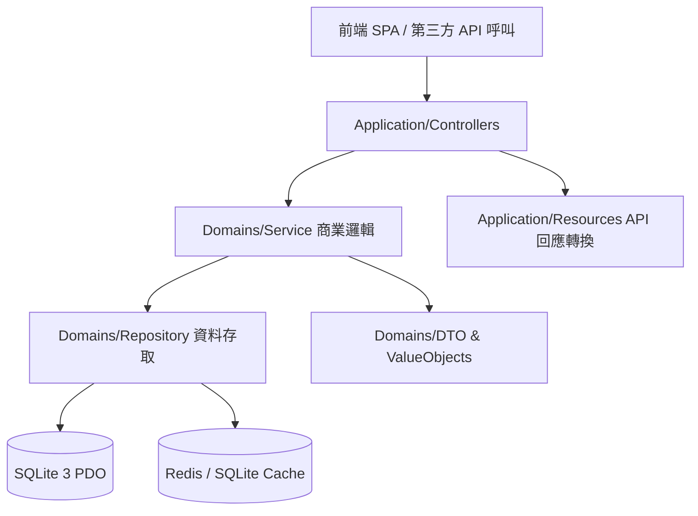

# AlleyNote 公告／佈告欄平台

> 採用 **領域驅動設計 (DDD)** 架構的現代化高效能公告平台 · PHP 8.4 自製 HTTP 引擎 + SQLite 3 + 無建構純 ES6 SPA


[](https://github.com/cookeyholder/AlleyNote/actions/workflows/ci.yml)
[](LICENSE)

---

## 📖 專案簡介

**AlleyNote** 是一個強調高擴充性、高安全性與零框架依賴的現代化公告與佈告欄平台。後端採用嚴謹的 **領域驅動設計（Domain-Driven Design, DDD）** 分層架構，基於 **PHP 8.4** 打造高效能 PSR-7/PSR-15 相容 HTTP 引擎；前端採用**無建構工具鏈的純 ES6 原生模組 (SPA)**，結合 Tailwind CSS 與 CKEditor 5，提供極致流暢的維運與使用體驗。

專案包含完整的角色權限管理 (RBAC)、多維度即時統計分析、站內通知系統、文章 Markdown 打包匯出、全站安全審計日誌與 OpenAPI 3.0 (Swagger UI) 互動文件。

---

## ✨ 核心亮點與功能特色

### 🏛️ 領域驅動設計 (DDD) 架構
- **7 大獨立 Bounded Context**:
  - 📝 **Post**: 公告文章 CRUD、標籤關聯、快取自動失效與 Markdown/批次匯出。
  - 🔒 **Auth**: RS256 JWT 非對稱認證、角色權限管理 (RBAC) 與存取權限控管。
  - 🔔 **Notification**: 使用者個人通知、未讀計數、標記已讀與全區系統廣播發送。
  - 📊 **Statistics**: 分析器模式 (Analyzer)、統計快照、時間分佈與圖表資料彙整。
  - 🛡️ **Security**: 活動日誌 (Activity Log)、速率限制 (Rate Limit)、XSS 防護與安全標頭。
  - ⚙️ **Setting**: 系統全域 Key-Value 設定與調控。
  - 📎 **Attachment**: 檔案上傳、MIME 安全驗證與附件關聯管理。

### ⚡ 原生高效能引擎
- **無大型框架包袱**: 自製 PSR-7/PSR-15 HTTP 引擎，結合 Nikic FastRoute 與 PHP-DI 7 依賴注入容器。
- **SQLite 3 + PDO 高級最佳化**: 針對查詢建立覆蓋索引與複合索引，百萬級資料查詢毫秒回應，無 ORM 效能損耗。
- **雙層快取與自動降級**: 優先使用 Redis (Predis)，當 Redis 無法連線時自動降級至 SQLite 快取。

### 🔒 企業級安全機制
- **RS256 JWT 非對稱金鑰簽署**: 比對公私鑰完成強效身份驗證。
- **全方位防禦**: 後端採用 HTML Purifier 進行嚴格 XSS 消毒，前端整合 DOMPurify。
- **安全標頭與 CSRF 防護**: 自動注入 CSP (Content Security Policy)、HSTS、X-Frame-Options 等安全標頭。
- **審計與速率限制**: 完整的 `user_activity_logs` 使用者活動追蹤與動態 IP 存取速率限制。

### 🎨 前端零建構架構
- **純 Native ES6 模組**: 無需 Webpack、Vite 或 Node.js 建構步驟，改動程式碼重新整理即可生效。
- **現代化 UI/UX**: Tailwind CSS CDN 載入、Chart.js 4.x 動態圖表、CKEditor 5 富文本編輯器。

### 🧪 嚴格品質與自動化驗證
- **PHPStan Level 10**: 通過最高標準靜態分析檢驗（嚴格無錯）。
- **完整測試涵蓋**: 通過 2,330+ 項 PHPUnit 單元與整合測試及 Playwright 端對端 (E2E) 測試。

---

## 🧭 角色導覽矩陣

| 您的角色 | 建議閱讀入口 | 說明 |
|----------|--------------|------|
| 🖥️ **後端開發者** | [`docs/domains/README.md`](docs/domains/README.md) | 了解 7 大 Bounded Context、DDD 依賴與依賴注入規範 |
| 🎨 **前端開發者** | [`docs/frontend/01-架構總覽.md`](docs/frontend/01-架構總覽.md) | 了解 ES6 模組架構、API 客戶端與全域 Store 管理 |
| 🔌 **API 整合者** | [`docs/api/README.md`](docs/api/README.md) | 查看 112 個 API 路由定義、Swagger UI 與測試驗證報告 |
| ⚙️ **系統管理員** | [`docs/guides/admin/README.md`](docs/guides/admin/README.md) | 檢視 Docker 部署、環境變數與效能與安全設定 |
| 📝 **內容管理者** | [`docs/guides/content-creators/01-管理後台使用手冊.md`](docs/guides/content-creators/01-管理後台使用手冊.md) | 查看管理後台操作、文章發布與 Markdown 匯出指引 |
| 👋 **新進成員** | [`docs/INDEX.md`](docs/INDEX.md) | 查閱專案 canonical 索引與完整文件地圖 |

---

## 🚀 快速開始

### 1. 前置需求
- **Docker Compose**: 2.0+
- **Git**
- **Curl** (用於測試 API)

### 2. 安裝與啟動步驟

```bash
# 1. 複製儲存庫
git clone https://github.com/cookeyholder/AlleyNote.git
cd AlleyNote

# 2. 設定環境變數
cp backend/.env.example backend/.env

# 3. 啟動 Docker 容器 (預設包含 PHP 8.4 + Nginx + Redis)
docker compose up -d
```

### 3. 服務存取與預設帳號

啟動完成後，即可存取以下服務端點：

- 🌐 **前台頁面**: [http://localhost:3000](http://localhost:3000)
- ⚙️ **管理後台**: [http://localhost:3000/admin](http://localhost:3000/admin)
- 📄 **Swagger UI 互動 API 文件**: [http://localhost:3000/api/swagger-ui](http://localhost:3000/api/swagger-ui)
- 🔍 **OpenAPI 3.0 規格檔 (JSON)**: [http://localhost:3000/api/openapi.json](http://localhost:3000/api/openapi.json)

#### 🔑 測試用預設登入憑證

| 角色 | 電子郵件 | 密碼 | 權限說明 |
|------|----------|------|----------|
| **超級管理員** | `admin@example.com` | `Admin@123456` | 擁有全站最高管理權限 (使用者/角色/設定/廣播) |
| **一般使用者** | `user@example.com` | `User@123456` | 擁有標準文章檢視、發布與站內通知權限 |

---

## 🛠️ 開發與測試指令

### 後端指令 (在 `backend/` 目錄中執行)

```bash
composer check-all      # 一鍵執行：靜態分析 (PHPStan L10) + 風格檢查 (CS-Fixer) + 2330+ PHPUnit 測試
composer test           # 執行 PHPUnit 單元與整合測試套件
composer test-coverage  # 執行測試並產生 HTML 覆蓋率報告
composer analyse        # 執行 PHPStan Level 10 靜態分析
composer cs-check       # 檢查 PHP 程式碼風格 (PER-CS2.0 / PHP 8.4)
composer cs-fix         # 自動修復 PHP 程式碼風格
```

### 前端指令 (在 `frontend/` 目錄中執行)

```bash
npm run dev             # 啟動開發伺服器 (Port 3000，自動將 /api 代理至後端 :8081)
npm run lint            # 執行 Prettier 前端程式碼格式檢查
npm run lint:fix        # 自動修復前端 Prettier 格式問題
```

### 端對端 E2E 測試 (在 `tests/e2e/` 目錄中執行)

```bash
npm test                # 執行 Playwright Headless 測試
npm run test:headed     # 帶有瀏覽器 GUI 執行 Playwright 測試
npm run test:ui         # 啟動 Playwright 互動式 UI 測試面板
```

---

## 🏗️ 系統架構與 DDD 分層

AlleyNote 的分層架構遵循商業邏輯與基礎設施嚴格分離原則：


```mermaid
graph TD
    Client[前端 SPA / 第三方 API 呼叫] --> Controller[Application/Controllers]
    Controller --> Service[Domains/Service 商業邏輯]
    Service --> Repository[Domains/Repository 資料存取]
    Service --> DTO[Domains/DTO & ValueObjects]
    Repository --> DB[(SQLite 3 PDO)]
    Repository --> Cache[(Redis / SQLite Cache)]
    Controller --> Resource[Application/Resources API 回應轉換]
```

### 分層說明：
- **Application Layer (`app/Application/`)**: 處理 HTTP 請求、控制器路由分發、中介層 (Middleware)、API Resource 轉換。
- **Domain Layer (`app/Domains/`)**: 包含 7 大 Bounded Context，封裝領域模型 (Model)、領域服務 (Service)、數值物件 (ValueObject)、DTO 與介面契約 (Contracts)。
- **Infrastructure Layer (`app/Infrastructure/`)**: 資料庫 PDO 實作、Redis 快取整合、日誌記錄、安全過濾等技術服務。

---

## 📁 專案結構

```
AlleyNote/
├── backend/                 # PHP 8.4 後端核心
│   ├── app/
│   │   ├── Application/     # Controllers, Middlewares, Resources
│   │   ├── Domains/         # 7 大 Bounded Context (Post, Auth, Notification, Statistics...)
│   │   ├── Infrastructure/  # PDO, Cache, Logger, Security 實作
│   │   └── Shared/          # 共享核心與 Helper
│   ├── config/              # PHP-DI 容器 (container.php) 與路由設定
│   ├── database/            # Phinx 資料庫遷移 (migrations) 與 Seeds
│   ├── public/              # Web 進入點 index.php
│   └── tests/               # 8 大類別測試套件 (Unit, Integration, Functional, E2E...)
├── frontend/                # 純 ES6 原生模組前端
│   ├── index.html           # 前端 SPA 進入點
│   ├── css/                 # 樣式表
│   └── js/                  # SPA API Client, Router, Components, Pages
├── docker/                  # Docker 容器環境設定 (php, nginx, redis)
├── tests/e2e/               # Playwright E2E 自動化測試
└── docs/                    # 完整規範與手冊
    ├── decisions/           # 架構決策記錄 (ADR)
    ├── domains/             # 7 大 Bounded Context 詳解
    ├── architecture/        # 後端引擎與統計模式分析
    ├── frontend/            # 前端無建構 SPA 架構設計
    ├── api/                 # OpenAPI 與 API 開發者指南
    └── runbooks/            # 開發與 CI/CD 操作 Runbooks
```

---

## 🛠️ 推薦開發工具鏈

為提升開發與維護效率，本專案建議搭配以下 CLI 工具：

| 工具 | 說明 | 常用範例 |
|------|------|----------|
| **codegraph** | 程式碼知識圖譜，精準查詢 Callers / Callees | `codegraph callers "NotificationService"` |
| **ripgrep (`rg`)** | 高速內容搜尋工具 | `rg "NotificationInterface" --type php` |
| **fd-find (`fd`)** | 快速檔案尋找工具 | `fd "Repository.php"` |
| **bat** | 帶有語法高亮的增強型 `cat` | `bat backend/config/container.php` |
| **jq** | JSON 解析與提取工具 | `jq '.scripts' backend/composer.json` |

---

## 🤝 參與貢獻與規範

我們非常歡迎社群開發者參與 AlleyNote 的建設！請遵循以下規範：

1. 詳閱 [🤝 貢獻指南 (CONTRIBUTING.md)](CONTRIBUTING.md)。
2. 提交程式碼前，請務必於本地執行 `composer check-all` 並確保測試 100% 通過。
3. 遵循 [🛡️ 文件治理規範 (docs/DOCUMENTATION_GOVERNANCE.md)](docs/DOCUMENTATION_GOVERNANCE.md) 同步更新對應文件。
4. 所有 Commit 訊息與 PR 說明均請使用**臺灣繁體中文 (zh-TW)**。

---

## 📜 授權條款

本專案採用 **[MIT 授權條款](LICENSE)** 釋出。
