# AlleyNote 公布欄網站

[](https://github.com/your-org/alleynote/actions)
[](https://github.com/your-org/alleynote/actions)
[](https://github.com/your-org/alleynote/actions)
[](https://www.php.net)
[](https://nodejs.org)
[](LICENSE)
[](docs/USER_ACTIVITY_LOGGING_TODO.md)
[](docs/ARCHITECTURE_AUDIT.md)
[](docs/UNIFIED_SCRIPTS_DOCUMENTATION.md)

> **🔥 新版本特色：前後端分離架構！**
> 採用 **PHP DDD 後端** + **Vite 前端** 的現代化架構，提供更好的開發體驗和使用者體驗。

---

## 目錄

- [專案簡介](#專案簡介)
- [🔥 前後端分離架構](#前後端分離架構)
- [功能特色](#功能特色)
- [技術架構](#技術架構)
- [專案結構說明](#專案結構說明)
- [系統需求](#系統需求)
- [快速開始](#快速開始)
- [開發指南](#開發指南)
- [測試流程](#測試流程)
- [部署說明](#部署說明)
- [🛠️ 維運工具](#維運工具)
- [常見問題 FAQ](#常見問題-faq)
- [文件資源](#文件資源)
- [授權](#授權)

---

## 專案簡介

AlleyNote 是一個現代化的公布欄網站系統，專為學校、社區、企業等單位設計，支援多用戶、權限控管、IP 黑白名單、附件上傳、資料自動備份等功能。

本專案以 **前後端分離架構** 重新設計，後端採用 PHP 8.4.11 + DDD（領域驅動設計），前端使用現代化的 Vite + JavaScript，並以 Docker 容器化部署，具備完善的自動化測試與 CI/CD 流程。

---

## 🔥 前後端分離架構

### 架構概覽

#### 🏗️ 系統架構圖

```mermaid
graph TB
    subgraph "🌐 客戶端層"
        Browser[瀏覽器]
    end

    subgraph "🐳 Docker 容器化環境"
        subgraph "🎨 前端服務 (Vite)"
            Frontend[前端應用程式<br/>Vite + JavaScript + CSS3]
            FrontendStatic[靜態資源<br/>public/]
            FrontendBuild[建構輸出<br/>dist/]
        end

        subgraph "🌐 Nginx 反向代理"
            Nginx[Nginx<br/>負載均衡 & SSL]
        end

        subgraph "⚡ 後端服務 (PHP-FPM)"
            subgraph "🎯 DDD 架構層"
                subgraph "🌟 領域層 (Domain)"
                    PostDomain[文章領域<br/>Post Domain]
                    AuthDomain[認證領域<br/>Auth Domain]
                    AttachmentDomain[附件領域<br/>Attachment Domain]
                    SecurityDomain[安全領域<br/>Security Domain]
                end

                subgraph "🚀 應用層 (Application)"
                    Controllers[控制器<br/>Controllers]
                    DTOs[資料傳輸物件<br/>DTOs]
                    Middleware[中介軟體<br/>Middleware]
                    Services[應用服務<br/>Services]
                end

                subgraph "🔧 基礎設施層 (Infrastructure)"
                    Database[資料庫存取<br/>Repositories]
                    Cache[快取系統<br/>Cache Manager]
                    FileSystem[檔案系統<br/>File Storage]
                end

                subgraph "🛠️ 共用層 (Shared)"
                    Validators[驗證器<br/>29種驗證規則]
                    Exceptions[例外處理<br/>Exception Handlers]
                    Helpers[輔助工具<br/>Helper Functions]
                end
            end
        end

        subgraph "💾 資料儲存層"
            SQLite[(SQLite 資料庫<br/>alleynote.sqlite3)]
            Storage[檔案儲存<br/>storage/]
        end
    end

    subgraph "🔄 開發工具"
        Scripts[統一腳本系統<br/>87個維運腳本]
        Tests[測試套件<br/>1,393個測試]
        CI[CI/CD Pipeline<br/>自動化部署]
    end

    %% 連接關係
    Browser --> Nginx
    Nginx --> Frontend
    Nginx --> Controllers

    Frontend --> FrontendStatic
    Frontend --> FrontendBuild

    Controllers --> DTOs
    Controllers --> Services
    DTOs --> Validators

    Services --> PostDomain
    Services --> AuthDomain
    Services --> AttachmentDomain
    Services --> SecurityDomain

    PostDomain --> Database
    AuthDomain --> Database
    AttachmentDomain --> Database
    SecurityDomain --> Database

    Database --> SQLite
    FileSystem --> Storage

    Controllers --> Cache
    Middleware --> SecurityDomain

    Scripts --> Tests
    Tests --> CI

    %% 樣式定義
    classDef frontend fill:#e1f5fe,stroke:#01579b,stroke-width:2px
    classDef backend fill:#f3e5f5,stroke:#4a148c,stroke-width:2px
    classDef domain fill:#fff3e0,stroke:#e65100,stroke-width:2px
    classDef infra fill:#e8f5e8,stroke:#2e7d32,stroke-width:2px
    classDef data fill:#ffebee,stroke:#c62828,stroke-width:2px
    classDef tools fill:#f1f8e9,stroke:#558b2f,stroke-width:2px

    class Frontend,FrontendStatic,FrontendBuild frontend
    class Controllers,DTOs,Middleware,Services backend
    class PostDomain,AuthDomain,AttachmentDomain,SecurityDomain domain
    class Database,Cache,FileSystem,Validators,Exceptions,Helpers infra
    class SQLite,Storage data
    class Scripts,Tests,CI tools
```



#### 📁 目錄結構
```
AlleyNote/
├── 🎨 frontend/          # 前端應用程式
│   ├── src/              # 源碼
│   ├── public/           # 靜態檔案
│   └── dist/             # 建構輸出
├── ⚡ backend/           # 後端 API
│   ├── app/              # DDD 架構程式碼
│   ├── config/           # 配置檔案
│   ├── database/         # 資料庫相關
│   └── tests/            # 測試檔案
└── 🐳 docker/            # 容器配置
```

### 技術堆疊
- **前端**: Vite + JavaScript + CSS3
- **後端**: PHP 8.4 + DDD Architecture
- **資料庫**: SQLite3
- **容器**: Docker + Nginx + PHP-FPM
- **建構工具**: Vite (前端) + Composer (後端)

---

## 功能特色

### 🚀 核心功能
- **文章管理**: 發布、編輯、刪除、置頂、封存
- **附件系統**: 上傳、下載、刪除，支援多種檔案格式
- **使用者系統**: 認證、權限管理、角色控制
- **安全控制**: IP 黑白名單、CSRF 防護、XSS 過濾
- **活動記錄**: 完整的使用者行為監控與異常檢測系統

### 🏗️ DDD 架構特色
- **領域驅動設計**: Post、Attachment、Auth、Security 四個業務領域
- **分層架構**: Domain → Application → Infrastructure → Shared
- **強型別驗證系統**: 29 種內建驗證規則，支援繁體中文
- **現代化 DI 容器**: PHP-DI 依賴注入，支援編譯快取
- **使用者活動記錄系統**: 21 種活動類型，智慧異常檢測，效能優化索引 ⭐
- **快取標籤與群組系統**: 高效能分層快取管理，支援標籤群組化 ⭐

### 🧪 品質保證
- **1,393 個測試**: 單元、整合、效能、安全測試（全面通過）
- **6,396 個斷言**: 完整的功能驗證覆蓋
- **100% 功能完成度**: 所有核心功能模組生產就緒
- **0 PHPStan 錯誤**: PHPStan Level 8+ 完全通過

### 🛠️ 統一腳本管理系統
- **58+ 腳本整合**: 統一為單一入口點管理
- **現代 PHP 8.4**: readonly 類別、union types、match 表達式
- **DDD 原則**: 值物件、介面分離、依賴注入
- **程式碼減少 85%**: 維護負擔大幅降低

### 🔧 維運功能
- **自動備份**: 資料庫與檔案自動備份
- **效能監控**: 快取統計、資料庫效能分析
- **Docker 容器化**: 開發與生產環境一致
- **SSL 支援**: Let's Encrypt 自動憑證管理

---

## 技術架構

### 🎯 核心技術棧
- **後端語言**: PHP 8.4.11（強型別、現代語法）
- **Web 伺服器**: NGINX（高效能、負載均衡）
- **資料庫**: SQLite3（零設定、檔案型資料庫）
- **快取系統**: File Cache + APCu（支援分散式快取）

### 🏗️ DDD 架構組件

#### 🎯 DDD 分層架構圖

```mermaid
graph TD
    subgraph "🌐 外部介面層"
        HTTP[HTTP 請求]
        CLI[命令列介面]
    end

    subgraph "🚀 應用層 (Application Layer)"
        subgraph "🎮 控制器"
            WebCtrl[Web 控制器]
            ApiCtrl[API 控制器]
            SecurityCtrl[安全控制器]
        end

        subgraph "📦 應用服務"
            AppServices[應用服務]
            DTOs[資料傳輸物件]
            Middleware[中介軟體]
        end
    end

    subgraph "🌟 領域層 (Domain Layer)"
        subgraph "📝 文章領域"
            PostEntity[文章實體]
            PostVO[文章值物件]
            PostService[文章服務]
            PostRepository[文章倉庫介面]
        end

        subgraph "🔐 認證領域"
            AuthEntity[使用者實體]
            AuthVO[認證值物件]
            AuthService[認證服務]
            AuthRepository[認證倉庫介面]
        end

        subgraph "📎 附件領域"
            AttachmentEntity[附件實體]
            AttachmentVO[附件值物件]
            AttachmentService[附件服務]
            AttachmentRepository[附件倉庫介面]
        end

        subgraph "🛡️ 安全領域"
            SecurityEntity[安全實體]
            SecurityVO[安全值物件]
            SecurityService[安全服務]
            SecurityRepository[安全倉庫介面]
        end
    end

    subgraph "🔧 基礎設施層 (Infrastructure Layer)"
        subgraph "💾 資料持久化"
            PostRepoImpl[文章倉庫實作]
            AuthRepoImpl[認證倉庫實作]
            AttachmentRepoImpl[附件倉庫實作]
            SecurityRepoImpl[安全倉庫實作]
        end

        subgraph "⚡ 快取系統"
            CacheManager[快取管理器]
            CacheKeys[快取金鑰]
            TagSystem[標籤系統]
        end

        subgraph "📁 檔案系統"
            FileStorage[檔案儲存]
            UploadHandler[上傳處理器]
        end
    end

    subgraph "🛠️ 共用層 (Shared Layer)"
        subgraph "✅ 驗證系統"
            Validators[29種驗證規則]
            ValidationResult[驗證結果]
        end

        subgraph "⚠️ 例外處理"
            DomainExceptions[領域例外]
            AppExceptions[應用例外]
            InfraExceptions[基礎設施例外]
        end

        subgraph "🔧 工具類別"
            Helpers[輔助函式]
            Constants[常數定義]
            Enums[列舉型別]
        end
    end

    subgraph "💾 資料儲存層"
        SQLite[(SQLite 資料庫)]
        FileSystem[(檔案系統)]
    end

    %% 連接關係
    HTTP --> WebCtrl
    HTTP --> ApiCtrl
    CLI --> SecurityCtrl

    WebCtrl --> AppServices
    ApiCtrl --> AppServices
    SecurityCtrl --> AppServices

    AppServices --> DTOs
    DTOs --> Validators

    AppServices --> PostService
    AppServices --> AuthService
    AppServices --> AttachmentService
    AppServices --> SecurityService

    PostService --> PostRepository
    AuthService --> AuthRepository
    AttachmentService --> AttachmentRepository
    SecurityService --> SecurityRepository

    PostRepository --> PostRepoImpl
    AuthRepository --> AuthRepoImpl
    AttachmentRepository --> AttachmentRepoImpl
    SecurityRepository --> SecurityRepoImpl

    PostRepoImpl --> SQLite
    AuthRepoImpl --> SQLite
    AttachmentRepoImpl --> SQLite
    SecurityRepoImpl --> SQLite

    AttachmentService --> FileStorage
    FileStorage --> FileSystem

    AppServices --> CacheManager
    CacheManager --> TagSystem

    PostService --> PostEntity
    PostService --> PostVO
    AuthService --> AuthEntity
    AuthService --> AuthVO
    AttachmentService --> AttachmentEntity
    AttachmentService --> AttachmentVO
    SecurityService --> SecurityEntity
    SecurityService --> SecurityVO

    Validators --> ValidationResult
    AppServices --> Helpers

    %% 樣式定義
    classDef application fill:#e3f2fd,stroke:#1976d2,stroke-width:2px
    classDef domain fill:#fff3e0,stroke:#f57c00,stroke-width:2px
    classDef infrastructure fill:#e8f5e8,stroke:#388e3c,stroke-width:2px
    classDef shared fill:#f3e5f5,stroke:#7b1fa2,stroke-width:2px
    classDef data fill:#ffebee,stroke:#d32f2f,stroke-width:2px

    class WebCtrl,ApiCtrl,SecurityCtrl,AppServices,DTOs,Middleware application
    class PostEntity,PostVO,PostService,PostRepository,AuthEntity,AuthVO,AuthService,AuthRepository,AttachmentEntity,AttachmentVO,AttachmentService,AttachmentRepository,SecurityEntity,SecurityVO,SecurityService,SecurityRepository domain
    class PostRepoImpl,AuthRepoImpl,AttachmentRepoImpl,SecurityRepoImpl,CacheManager,CacheKeys,TagSystem,FileStorage,UploadHandler infrastructure
    class Validators,ValidationResult,DomainExceptions,AppExceptions,InfraExceptions,Helpers,Constants,Enums shared
    class SQLite,FileSystem data
```



#### 🔍 架構說明
- **Domain 層**: 業務實體、值物件、領域服務 (161 類別)
- **Application 層**: 應用服務、控制器、DTO (15 檔案)
- **Infrastructure 層**: 資料庫、外部服務、技術實作 (46 檔案)
- **Shared 層**: 共用元件、驗證器、例外處理 (20 檔案)

### 🛠️ 開發工具
- **自動化測試**: PHPUnit, PHPStan Level 8, PHPCS
- **容器化**: Docker, Docker Compose
- **依賴管理**: Composer
- **程式碼品質**: PHP-CS-Fixer

### 🔒 安全與維運
- **SSL 憑證**: Let's Encrypt 自動續簽
- **備份策略**: 自動備份與災難復原
- **作業系統**: Debian Linux 12

---

## 統一腳本管理系統

### 🚀 系統概述
基於零錯誤修復成功經驗和最新 PHP 8.4 最佳實務，我們建立了統一腳本管理系統，將原本分散的 58+ 個維運腳本整合為一個現代化、統一的管理平台。

### ⭐ 主要特色
- **統一入口點**: `php scripts/unified-scripts.php <command> [options]`
- **現代 PHP 語法**: 採用 readonly 類別、union types、match 表達式
- **DDD 原則實踐**: 值物件設計、介面分離、依賴注入
- **85% 程式碼減少**: 從 58+ 腳本減少到 9 個核心類別

### 🎯 核心功能

#### 1. 錯誤修復 (ConsolidatedErrorFixer)
```bash
# 自動修復 PHPStan 錯誤
php scripts/unified-scripts.php fix --type=type-hints

# 修復所有類型錯誤
php scripts/unified-scripts.php fix --type=all
```

#### 2. 測試管理 (ConsolidatedTestManager)
```bash
# 執行完整測試套件
php scripts/unified-scripts.php test --action=run

# 生成覆蓋率報告
php scripts/unified-scripts.php test --action=coverage
```

#### 3. 專案分析 (ConsolidatedAnalyzer)
```bash
# 完整架構分析
php scripts/unified-scripts.php analyze --type=full

# 現代 PHP 特性分析
php scripts/unified-scripts.php analyze --type=modern-php
```

#### 4. 部署管理 (ConsolidatedDeployer)
```bash
# 部署到生產環境
php scripts/unified-scripts.php deploy --env=production

# 部署到測試環境
php scripts/unified-scripts.php deploy --env=staging
```

#### 5. 維護功能 (ConsolidatedMaintainer)
```bash
# 執行完整維護
php scripts/unified-scripts.php maintain --task=all

# 清理快取
php scripts/unified-scripts.php maintain --task=cache
```

### 📊 系統狀態檢查
```bash
# 查看專案健康狀況
php scripts/unified-scripts.php status

# 列出所有可用命令
php scripts/unified-scripts.php list
```

### 🎭 展示功能
無需 Docker 環境即可體驗：
```bash
# PHP 版本展示
php scripts/demo-unified-scripts.php demo

# Bash 版本展示
./scripts/demo-unified-scripts.sh demo
```

### 📚 完整文件
- **[統一腳本使用文件](docs/UNIFIED_SCRIPTS_DOCUMENTATION.md)**: 詳細使用說明
- **[腳本遷移計劃](docs/SCRIPT_CONSOLIDATION_MIGRATION_PLAN.md)**: 整合策略與實作
- **[腳本清理報告](docs/SCRIPTS_CLEANUP_REPORT.md)**: 清理成果統計
- **[完成總結報告](docs/UNIFIED_SCRIPTS_COMPLETION_SUMMARY.md)**: 建立完成摘要

---

## 📁 專案架構

```
AlleyNote/
├── backend/                 # 後端 PHP 應用程式
│   ├── app/                # 應用程式原始碼（DDD 架構）
│   │   ├── Application/    # 應用服務層
│   │   │   ├── Controllers/ # HTTP 控制器
│   │   │   ├── DTOs/       # 資料傳輸物件
│   │   │   ├── Middleware/ # 中介軟體
│   │   │   └── Services/   # 應用服務
│   │   ├── Domains/        # 領域層
│   │   │   ├── Auth/       # 認證領域
│   │   │   ├── Post/       # 文章領域
│   │   │   ├── Attachment/ # 附件領域
│   │   │   └── Security/   # 安全領域
│   │   ├── Infrastructure/ # 基礎設施層
│   │   └── Shared/         # 共用元件
│   ├── tests/              # 測試套件（1,393 個測試）
│   │   ├── Unit/          # 單元測試
│   │   ├── Integration/   # 整合測試
│   │   ├── Security/      # 安全測試
│   │   └── Factory/       # 測試工廠
│   ├── scripts/           # 後端腳本管理系統
│   │   ├── consolidated/  # 9 個核心類別
│   │   ├── unified-scripts.php # 統一入口點
│   │   ├── demo-*.php/sh # 展示版本
│   │   └── [基礎設施腳本] # 87 個保留腳本
│   ├── public/            # 後端公開檔案
│   ├── database/          # SQLite 資料庫
│   ├── storage/           # 檔案儲存
│   ├── examples/          # 程式碼範例
│   └── coverage-reports/  # 測試覆蓋率報告
├── frontend/              # 前端 Vue.js 應用程式
│   ├── src/              # 前端原始碼
│   ├── public/           # 前端公開檔案
│   └── dist/             # 建構輸出（生產環境）
├── docs/                 # 技術文件（36 個文件）
├── docker/               # Docker 設定
├── .github/workflows/    # CI/CD 流程
├── certbot-data/         # SSL 憑證資料
└── ssl-data/             # SSL 設定資料
```

---

## 快速開始

### 🚀 3 分鐘啟動

```bash
# 1. 複製專案
git clone https://github.com/your-org/alleynote.git
cd alleynote

# 2. 設定環境變數
cp .env.example .env

# 3. 啟動所有服務
npm run docker:up

# 4. 等待服務啟動後，開啟瀏覽器
open http://localhost
```

### 📱 訪問應用程式
- **前端應用**: http://localhost (透過 Nginx)
- **開發模式**: http://localhost:3000 (Vite 開發伺服器)
- **API 文件**: http://localhost/api/docs/ui
- **後端健康檢查**: http://localhost/health

---

## 系統需求

### 💻 開發環境
- **Node.js**: 18.0+ (前端開發)
- **PHP**: 8.4+ (後端開發)
- **Docker**: 24.0+ (容器化部署)
- **Docker Compose**: 2.20+

### 🖥️ 生產環境
- CPU: 2 核心以上
- 記憶體: 4GB 以上
- 硬碟空間: 20GB 以上

### 軟體需求
- Debian Linux 12
- Docker 24.0.0+
- Docker Compose 2.20.0+
- PHP 8.4.11
- SQLite3
- NGINX

---

## 安裝與開發指南

### 🚀 快速開始 (推薦)

```bash
# 1. 複製專案
git clone https://github.com/your-org/alleynote.git
cd alleynote

# 2. 一鍵啟動開發環境
npm run dev

# 3. 等待啟動完成，開啟瀏覽器
open http://localhost:3000  # 前端開發伺服器
open http://localhost       # 完整服務 (透過 Nginx)
```

### 📋 完整安裝步驟

#### 1️⃣ 環境準備
```bash
# 檢查環境需求
node --version   # 需要 18.0+
docker --version # 需要 24.0+

# 如果缺少 Node.js，安裝 Node.js
curl -o- https://raw.githubusercontent.com/nvm-sh/nvm/v0.39.0/install.sh | bash
nvm install 18 && nvm use 18
```

#### 2️⃣ 專案初始化
```bash
# 複製專案
git clone https://github.com/your-org/alleynote.git
cd alleynote

# 安裝開發工具依賴
npm install

# 設定環境變數
cp .env.example .env
# 編輯 .env 檔案調整設定 (可選)
```

#### 3️⃣ 前端設定
```bash
# 安裝前端依賴
npm run frontend:install
# 相當於: cd frontend && npm install && cd ..
```

#### 4️⃣ 後端設定
```bash
# 啟動後端容器並安裝 PHP 依賴
npm run backend:install
# 相當於: docker compose up -d && docker compose exec web composer install
```

#### 5️⃣ 資料庫初始化
```bash
# 初始化 SQLite 資料庫
npm run db:init

# 載入範例資料 (可選)
npm run db:seed
```

#### 6️⃣ 啟動開發服務
```bash
# 方式 1: 同時啟動前後端開發伺服器
npm run dev

# 方式 2: 分別啟動
npm run backend:up     # 啟動後端 + 資料庫
npm run frontend:dev   # 啟動前端開發伺服器
```

### 🔧 開發工作流程

#### 📝 前端開發
```bash
cd frontend

# 啟動開發伺服器 (熱重載)
npm run dev

# 建構生產版本
npm run build

# 本地預覽生產版本
npm run preview
```

#### ⚙️ 後端開發
```bash
# 進入後端容器
docker compose exec web bash

# 執行測試
composer test

# 程式碼品質檢查
composer ci

# 查看後端日誌
docker compose logs -f web
```

### 🧪 測試與品質檢查

```bash
# 執行完整測試套件
npm run test

# 分別執行前後端測試
npm run frontend:test  # 前端測試
npm run backend:test   # 後端測試

# 程式碼品質檢查
npm run lint          # 前後端 lint
npm run backend:cs    # PHP 程式碼風格檢查
```

### 📱 服務網址

| 服務 | 開發環境 | 生產環境 |
|------|---------|----------|
| 🌐 前端應用 | http://localhost:3000 | http://localhost |
| 🔌 API 服務 | http://localhost/api | http://localhost/api |
| 📚 API 文件 | http://localhost/api/docs/ui | http://localhost/api/docs/ui |
| ❤️ 健康檢查 | http://localhost/health | http://localhost/health |
| 📊 監控儀表板 | http://localhost:8081 | - |

### 🛠️ 常用指令

```bash
# 🔄 重新啟動服務
npm run restart

# 🧹 清理快取和建構檔案
npm run clean

# 📦 建構生產版本
npm run build

# 🚀 部署到生產環境
npm run deploy

# 🔍 查看所有可用指令
npm run help
```

---

## 開發流程

### 📋 標準開發流程

1. **準備工作**
   ```bash
   git checkout -b feature/your-feature-name
   ```

2. **開發實作**（遵循 DDD 原則）
   ```bash
   # 先寫測試
   vim tests/Unit/Domains/Post/Services/PostServiceTest.php

   # 實作領域邏輯
   vim app/Domains/Post/Services/PostService.php

   # 更新應用層
   vim app/Application/Controllers/Api/V1/PostController.php
   ```

3. **品質檢查**
   ```bash
   # 使用統一腳本系統執行測試
   docker compose exec web php scripts/unified-scripts.php test --action=run

   # 靜態分析
   docker compose exec web php scripts/unified-scripts.php fix --type=all

   # 專案狀態檢查
   docker compose exec web php scripts/unified-scripts.php status
   ```

4. **提交流程**
   ```bash
   git commit -m "feat(post): 新增文章分類功能

   - 實作分類管理服務
   - 新增分類 API 端點
   - 完善測試覆蓋

   Closes #123"
   ```

---

## 測試流程

### 📊 測試統計
- **總測試數**: 1,393 個測試
- **總斷言數**: 6,396 個斷言
- **通過率**: 100%（全面通過）
- **功能完成度**: 100%（所有核心功能生產就緒）
- **執行時間**: 優化後效能提升

### 🧪 測試分類

#### 🎯 測試架構圖

```mermaid
graph TB
    subgraph "🧪 測試套件總覽"
        TestSuite[測試套件<br/>1,393 個測試<br/>6,396 個斷言]
    end

    subgraph "📊 測試分類"
        subgraph "🔬 單元測試 (Unit Tests)"
            DomainTests[領域邏輯測試<br/>實體、值物件、服務]
            ServiceTests[服務層測試<br/>業務邏輯驗證]
            ValidatorTests[驗證器測試<br/>29種驗證規則]
        end

        subgraph "🔗 整合測試 (Integration Tests)"
            ApiTests[API 端點測試<br/>HTTP 請求/回應]
            DatabaseTests[資料庫整合測試<br/>CRUD 操作]
            CacheTests[快取系統測試<br/>快取標籤機制]
        end

        subgraph "🛡️ 安全測試 (Security Tests)"
            XssTests[XSS 防護測試<br/>跨站腳本攻擊]
            CsrfTests[CSRF 防護測試<br/>跨站請求偽造]
            SqlTests[SQL 注入測試<br/>資料庫安全]
            AuthTests[認證測試<br/>權限控制]
        end

        subgraph "⚡ 效能測試 (Performance Tests)"
            QueryTests[查詢效能測試<br/>資料庫最佳化]
            CachePerf[快取效能測試<br/>命中率分析]
            MemoryTests[記憶體使用測試<br/>資源管理]
        end
    end

    subgraph "🏭 測試工廠 (Test Factories)"
        PostFactory[文章工廠<br/>測試資料生成]
        UserFactory[使用者工廠<br/>認證資料生成]
        AttachmentFactory[附件工廠<br/>檔案測試資料]
        SecurityFactory[安全工廠<br/>安全測試資料]
    end

    subgraph "🛠️ 測試工具"
        PHPUnit[PHPUnit 11.5<br/>測試框架]
        Coverage[程式碼覆蓋率<br/>詳細報告]
        MockFramework[Mock 框架<br/>依賴模擬]
        Assertions[自訂斷言<br/>業務邏輯驗證]
    end

    subgraph "📊 測試報告"
        CoverageReport[覆蓋率報告<br/>HTML 格式]
        TestResults[測試結果<br/>詳細統計]
        PerformanceReport[效能報告<br/>執行時間分析]
    end

    %% 連接關係
    TestSuite --> DomainTests
    TestSuite --> ServiceTests
    TestSuite --> ValidatorTests
    TestSuite --> ApiTests
    TestSuite --> DatabaseTests
    TestSuite --> CacheTests
    TestSuite --> XssTests
    TestSuite --> CsrfTests
    TestSuite --> SqlTests
    TestSuite --> AuthTests
    TestSuite --> QueryTests
    TestSuite --> CachePerf
    TestSuite --> MemoryTests

    DomainTests --> PostFactory
    ServiceTests --> UserFactory
    ApiTests --> AttachmentFactory
    SecurityTests --> SecurityFactory

    XssTests --> SecurityFactory
    CsrfTests --> SecurityFactory
    SqlTests --> SecurityFactory
    AuthTests --> SecurityFactory

    TestSuite --> PHPUnit
    PHPUnit --> Coverage
    PHPUnit --> MockFramework
    PHPUnit --> Assertions

    Coverage --> CoverageReport
    PHPUnit --> TestResults
    QueryTests --> PerformanceReport
    CachePerf --> PerformanceReport
    MemoryTests --> PerformanceReport

    %% 樣式定義
    classDef unit fill:#e8f5e8,stroke:#2e7d32,stroke-width:2px
    classDef integration fill:#e3f2fd,stroke:#1976d2,stroke-width:2px
    classDef security fill:#ffebee,stroke:#c62828,stroke-width:2px
    classDef performance fill:#fff3e0,stroke:#f57c00,stroke-width:2px
    classDef factory fill:#f3e5f5,stroke:#7b1fa2,stroke-width:2px
    classDef tools fill:#f1f8e9,stroke:#558b2f,stroke-width:2px
    classDef reports fill:#fce4ec,stroke:#ad1457,stroke-width:2px

    class DomainTests,ServiceTests,ValidatorTests unit
    class ApiTests,DatabaseTests,CacheTests integration
    class XssTests,CsrfTests,SqlTests,AuthTests security
    class QueryTests,CachePerf,MemoryTests performance
    class PostFactory,UserFactory,AttachmentFactory,SecurityFactory factory
    class PHPUnit,Coverage,MockFramework,Assertions tools
    class CoverageReport,TestResults,PerformanceReport reports
```



#### 📋 測試類型說明
- **單元測試** (`tests/Unit/`): 領域邏輯、服務層、驗證器
- **整合測試** (`tests/Integration/`): API 端點、資料庫整合
- **安全測試** (`tests/Security/`): XSS、CSRF、SQL 注入防護
- **效能測試**: 資料庫查詢、快取效能

### 🚀 執行測試

```bash
# 使用統一腳本系統執行測試
docker compose exec web php scripts/unified-scripts.php test --action=run

# 生成覆蓋率報告
docker compose exec web php scripts/unified-scripts.php test --action=coverage

# 傳統方式（仍可使用）
docker compose exec web ./vendor/bin/phpunit

# 分類測試
docker compose exec web ./vendor/bin/phpunit --testsuite Unit
docker compose exec web ./vendor/bin/phpunit --testsuite Integration
docker compose exec web ./vendor/bin/phpunit --testsuite Security
```

---

## 快速部署（管理員）

🚀 **新管理員**：請先閱讀 [管理員快速入門指南](docs/ADMIN_QUICK_START.md)，30分鐘內完成部署！

### 基本部署步驟
```bash
# 1. 克隆專案
git clone https://github.com/cookeyholder/alleynote.git
cd alleynote

# 2. 快速啟動
docker compose up -d

# 3. 初始化資料庫
docker compose exec web ./scripts/init-sqlite.sh

# 4. 檢查系統狀態
docker compose exec web php scripts/unified-scripts.php status
```

### 完整管理文件
- **[系統需求檢查](docs/SYSTEM_REQUIREMENTS.md)** - 環境準備和需求確認
- **[完整部署指南](docs/DEPLOYMENT.md)** - 詳細部署流程
- **[管理員操作手冊](docs/ADMIN_MANUAL.md)** - 日常管理和維護
- **[故障排除指南](docs/TROUBLESHOOTING_GUIDE.md)** - 問題診斷和解決

### SSL 憑證設定
```bash
./scripts/ssl-setup.sh your-domain.com admin@your-domain.com
```

---

## 常見問題 FAQ

**Q: 如何使用新的統一腳本系統？**
A: 執行 `docker compose exec web php scripts/unified-scripts.php status` 查看系統狀態，參考 [統一腳本文件](docs/UNIFIED_SCRIPTS_DOCUMENTATION.md)。

**Q: 舊的腳本還能使用嗎？**
A: 重要的基礎設施腳本（備份、SSL、部署）仍保留可用，58+ 個開發工具腳本已整合到統一系統。

**Q: 系統無法啟動怎麼辦？**
A: 參考 [故障排除指南](docs/TROUBLESHOOTING_GUIDE.md) 的緊急故障處理章節。

**Q: 如何進行日常維護？**
A: 使用 `docker compose exec web php scripts/unified-scripts.php maintain --task=all` 或查看 [管理員操作手冊](docs/ADMIN_MANUAL.md)。

**Q: 測試失敗如何除錯？**
A: 檢查 [TEST_SUITE_IMPROVEMENTS.md](docs/TEST_SUITE_IMPROVEMENTS.md) 了解測試改善歷程和除錯方法。

**Q: 如何還原備份？**
A: 參考 [管理員操作手冊](docs/ADMIN_MANUAL.md) 的備份與還原章節。

**Q: 系統需求是什麼？**
A: 詳見 [系統需求說明](docs/SYSTEM_REQUIREMENTS.md)。

---

## 文件資源

### 👨‍💼 管理員文件
- **[ADMIN_QUICK_START.md](docs/ADMIN_QUICK_START.md)**: 30分鐘快速入門指南 ⭐
- **[SYSTEM_REQUIREMENTS.md](docs/SYSTEM_REQUIREMENTS.md)**: 系統需求和環境準備
- **[ADMIN_MANUAL.md](docs/ADMIN_MANUAL.md)**: 完整管理員操作手冊
- **[TROUBLESHOOTING_GUIDE.md](docs/TROUBLESHOOTING_GUIDE.md)**: 故障排除和維護指南

### �️ 維運工具文件
- **[UNIFIED_SCRIPTS_DOCUMENTATION.md](docs/UNIFIED_SCRIPTS_DOCUMENTATION.md)**: 統一腳本系統完整指南 ⭐
- **[SCRIPT_CONSOLIDATION_MIGRATION_PLAN.md](docs/SCRIPT_CONSOLIDATION_MIGRATION_PLAN.md)**: 腳本整合策略文件
- **[SCRIPTS_CLEANUP_REPORT.md](docs/SCRIPTS_CLEANUP_REPORT.md)**: 腳本清理成果報告
- **[UNIFIED_SCRIPTS_COMPLETION_SUMMARY.md](docs/UNIFIED_SCRIPTS_COMPLETION_SUMMARY.md)**: 系統建立完成總結

### 📖 開發者文件
- **[DEVELOPER_GUIDE.md](docs/DEVELOPER_GUIDE.md)**: 完整開發者指南
- **[DI_CONTAINER_GUIDE.md](docs/DI_CONTAINER_GUIDE.md)**: DI 容器使用手冊
- **[VALIDATOR_GUIDE.md](docs/VALIDATOR_GUIDE.md)**: 驗證器詳細指南
- **[API_DOCUMENTATION.md](docs/API_DOCUMENTATION.md)**: API 文件
- **[USER_ACTIVITY_LOGGING_ARCHITECTURE.md](docs/USER_ACTIVITY_LOGGING_ARCHITECTURE.md)**: 使用者活動記錄系統架構 ⭐
- **[CACHE_TAGGING_SYSTEM_GUIDE.md](docs/CACHE_TAGGING_SYSTEM_GUIDE.md)**: 快取標籤系統使用指南 ⭐

### 📋 專案文件
- **[ARCHITECTURE_AUDIT.md](docs/ARCHITECTURE_AUDIT.md)**: 架構審查報告
- **[USER_ACTIVITY_LOGGING_TODO.md](docs/USER_ACTIVITY_LOGGING_TODO.md)**: 專案狀態與完成報告 ⭐
- **[DEPLOYMENT.md](docs/DEPLOYMENT.md)**: 詳細部署說明
- **[SSL_DEPLOYMENT_GUIDE.md](docs/SSL_DEPLOYMENT_GUIDE.md)**: SSL 設定指南
- **[CHANGELOG.md](CHANGELOG.md)**: 版本更新日誌

### 🏗️ 遷移文件
- **[前後端分離完成報告](docs/migration/FRONTEND_BACKEND_SEPARATION_COMPLETION_REPORT.md)**: 詳細的架構遷移記錄與最佳實踐 🆕

### 📊 規劃文件
- **[AlleyNote公布欄網站規格書.md](docs/architecture/AlleyNote公布欄網站規格書.md)**: 系統規格
- **[USER_ACTIVITY_LOGGING_SPEC.md](docs/USER_ACTIVITY_LOGGING_SPEC.md)**: 使用者活動記錄規格 ⭐
- **[CACHE_TAGGING_SYSTEM_API_REFERENCE.md](docs/CACHE_TAGGING_SYSTEM_API_REFERENCE.md)**: 快取系統 API 參考 ⭐

---

## 🎯 專案里程碑

### ✅ 已完成（100%）
- 🏗️ **MVC 到 DDD 架構遷移** - 完整領域驅動設計實現
- 🧪 **測試套件穩定性改善** - 1,393 個測試，100% 通過率
- 🔍 **強型別驗證系統** - 29 種內建驗證規則
- ⚡ **效能優化與監控工具** - 快取標籤系統、效能監控
- 🔒 **完整安全防護機制** - XSS、CSRF、SQL 注入防護
- 🛠️ **統一腳本管理系統** - 85% 程式碼減少，現代化管理
- 🎯 **零 PHPStan 錯誤狀態** - Level 8+ 完全通過
- 📊 **使用者活動記錄系統** - 21 種活動類型，智慧監控 ⭐
- 🚀 **快取標籤與群組系統** - 高效能分層快取管理 ⭐

### � 生產就緒狀態
- ✅ **所有核心功能模組** - 100% 完成，生產部署準備就緒
- ✅ **文檔體系完善** - 37 個技術文檔，涵蓋開發、部署、維運
- ✅ **品質保證達標** - 6,396 個斷言，全面功能驗證
- ✅ **安全與效能** - 企業級安全標準，高效能快取系統

---

## 貢獻指南

1. Fork 專案並建立分支
2. 遵循 DDD 架構原則開發
3. 撰寫/更新測試
4. 確保程式碼品質檢查通過
5. 提交 Pull Request，說明變更內容

---

## 授權

本專案採用 MIT 授權，詳見 [LICENSE](LICENSE)。

---

## 聯絡方式

- **Issues**: [GitHub Issues](https://github.com/cookeyholder/alleynote/issues)
- **Wiki**: [專案 Wiki](https://github.com/cookeyholder/alleynote/wiki)

---

*🎉 歡迎貢獻！請先閱讀 [docs/DEVELOPER_GUIDE.md](docs/DEVELOPER_GUIDE.md) 了解開發流程。*
