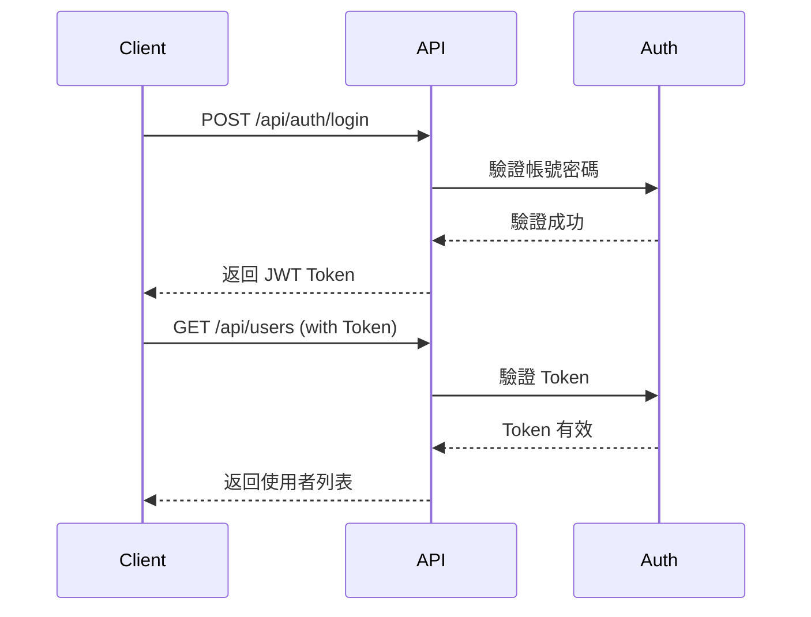

# AlleyNote API 文件

歡迎來到 AlleyNote API 文件中心！這裡包含了完整的 API 使用指南、開發文件和驗證報告。

---

## 📚 文件索引

### 📖 使用者文件

| 文件 | 說明 | 適合對象 |
|-----|------|---------|
| [API 使用指南](./API_USAGE_GUIDE.md) | 完整的 API 使用說明，包含範例 | API 使用者、前端開發者 |
| [OpenAPI 驗證報告](./OPENAPI_VERIFICATION_REPORT.md) | OpenAPI 規格驗證與測試結果 | 技術經理、QA 工程師 |

### 👨‍💻 開發者文件

| 文件 | 說明 | 適合對象 |
|-----|------|---------|
| [開發者指南](./DEVELOPER_GUIDE.md) | API 開發規範與最佳實踐 | 後端開發者 |
| [錯誤碼說明](./ERROR_CODES.md) | 完整的錯誤碼定義與處理 | 所有開發者 |
| [使用率限制](./RATE_LIMITS.md) | API 使用率限制詳細說明 | 所有開發者 |
| [API 版本控制](./API_VERSIONING.md) | 版本策略與遷移指南 | 所有開發者 |

---

## 🚀 快速開始

### 1. 查看 API 文件

在瀏覽器中開啟 Swagger UI：

```
http://localhost:8080/api/docs/ui
```

### 2. 取得 OpenAPI 規格

```bash
curl http://localhost:8080/api/docs
```

### 3. 測試 API 健康狀態

```bash
curl http://localhost:8080/api/health
```

---

## 📊 API 概覽

### 當前版本

- **API 版本**: 1.0.0
- **OpenAPI 版本**: 3.0.0
- **最後更新**: 2025-10-11

### API 統計

| 項目 | 數量 |
|-----|------|
| **API Tags** | 12 個 |
| **API 端點** | 45+ 個 |
| **認證方式** | JWT Token |

### 主要功能模組

#### 🔐 認證授權（Auth）
- 使用者註冊
- 登入/登出
- Token 刷新
- 使用者資訊查詢

#### 👥 使用者管理（Users）⭐ 新增
- 使用者 CRUD 操作
- 角色分配
- 帳號狀態管理（啟用/停用）
- 密碼重設

#### 🎭 角色管理（Roles）⭐ 新增
- 角色 CRUD 操作
- 權限管理
- 角色與權限關聯

#### 🔑 權限管理（Permissions）⭐ 新增
- 權限查詢
- 權限分組查詢
- 權限詳細資訊

#### ⚙️ 系統設定（Settings）⭐ 新增
- 系統設定 CRUD
- 批量更新設定
- 時區管理

#### 📝 文章管理（Posts）
- 文章 CRUD 操作
- 文章發布控制
- 文章置頂管理

#### 🏷️ 標籤管理（Tags）
- 標籤 CRUD 操作
- 標籤統計

#### 📎 附件管理（Attachments）
- 檔案上傳
- 檔案下載

#### 📊 統計數據（Statistics）
- 文章統計
- 使用者統計
- 標籤統計

#### 📋 活動日誌（Activity Log）
- 活動日誌查詢
- 日誌篩選

---

## 🎯 最近更新（2025-10-11）

### ✨ 新功能

1. **Users Management API**
   - ✅ 9 個完整的使用者管理端點
   - ✅ 支援分頁和搜尋
   - ✅ 管理員專用操作（啟用/停用/重設密碼）

2. **Roles Management API**
   - ✅ 6 個完整的角色管理端點
   - ✅ 動態權限分配
   - ✅ 角色與權限關聯管理

3. **Permissions Management API**
   - ✅ 3 個權限查詢端點
   - ✅ 支援按資源分組查詢

4. **Settings Management API**
   - ✅ 5 個系統設定管理端點
   - ✅ 支援批量更新
   - ✅ 時區資訊查詢

### 📝 文件更新

- ✅ 完整的 OpenAPI 3.0 註解
- ✅ 詳細的 API 使用指南
- ✅ 開發者指南與規範
- ✅ OpenAPI 驗證報告

### 🔍 品質保證

- ✅ 通過 PHP CS Fixer 程式碼風格檢查
- ✅ 通過 PHPStan Level 10 靜態分析
- ✅ 所有端點正確註冊到 OpenAPI 規格
- ✅ Swagger UI 正常運作

---

## 📖 使用指南

### 基本認證流程



### 標準請求格式

```bash
curl -X {METHOD} http://localhost:8080/api/{endpoint} \
  -H "Authorization: Bearer YOUR_ACCESS_TOKEN" \
  -H "Content-Type: application/json" \
  -d '{"key": "value"}'
```

### 標準回應格式

```json
{
  "success": true,
  "data": {},
  "message": "操作成功"
}
```

---

## 🛠️ 開發工具

### Swagger UI

最直觀的 API 文件瀏覽與測試工具。

**訪問方式**: http://localhost:8080/api/docs/ui

**功能特色**:
- 📱 互動式 API 文件
- 🧪 線上測試功能
- 📋 自動產生程式碼範例
- 🎨 清晰的視覺化介面

### OpenAPI JSON

標準的 OpenAPI 3.0 規格文件，可用於自動生成客戶端 SDK。

**訪問方式**: http://localhost:8080/api/docs

**用途**:
- 自動生成 API 客戶端
- 整合到 CI/CD 流程
- API 版本管理
- 文件自動化

---

## 🔗 相關連結

### 線上資源
- **Swagger UI**: http://localhost:8080/api/docs/ui
- **OpenAPI JSON**: http://localhost:8080/api/docs
- **API 資訊**: http://localhost:8080/api
- **健康檢查**: http://localhost:8080/api/health

### 開發資源
- [PHP 官方文件](https://www.php.net/)
- [OpenAPI 規範](https://swagger.io/specification/)
- [PSR 標準](https://www.php-fig.org/psr/)
- [Swagger 工具](https://swagger.io/tools/)

---

## 🎓 學習資源

### 適合初學者

1. 閱讀 [API 使用指南](./API_USAGE_GUIDE.md)
2. 了解 [錯誤碼說明](./ERROR_CODES.md)
3. 查看 [使用率限制](./RATE_LIMITS.md)
4. 在 Swagger UI 中探索 API
5. 使用 Postman 測試簡單的端點

### 適合開發者

1. 閱讀 [開發者指南](./DEVELOPER_GUIDE.md)
2. 了解 [API 版本控制](./API_VERSIONING.md)策略
3. 學習 OpenAPI 註解規範
4. 了解錯誤處理與使用率限制
5. 學習 DDD 架構設計
6. 參與程式碼貢獻

---

## 📞 技術支援

### 回報問題

如果您發現 API 文件或功能有任何問題，請：

1. 查看 [常見問題](./DEVELOPER_GUIDE.md#常見問題)
2. 搜尋現有的 GitHub Issues
3. 建立新的 Issue 並提供詳細資訊

### 建議與回饋

歡迎透過以下方式提供建議：

- 📧 發送郵件給開發團隊
- 💬 在 GitHub Discussions 中討論
- 🐛 提交 Pull Request

---

## 📋 版本記錄

### v1.0.1 (2025-10-11)

#### 新增文件
- 📝 錯誤碼說明文件（ERROR_CODES.md）
- 📝 API 使用率限制文件（RATE_LIMITS.md）
- 📝 API 版本控制策略（API_VERSIONING.md）

#### 新增功能
- ✨ 統一的錯誤碼系統（ErrorCode Enum）
- ✨ API 使用率限制配置（ApiRateLimits）
- ✨ 完整的錯誤處理說明
- ✨ 詳細的使用率限制規範

#### 改進
- 🔧 更新 API 文件索引
- 🔧 補充版本控制說明
- 🔧 添加遷移指南

### v1.0.0 (2025-10-11)

#### 新增功能
- ✨ Users Management API（9 個端點）
- ✨ Roles Management API（6 個端點）
- ✨ Permissions Management API（3 個端點）
- ✨ Settings Management API（5 個端點）

#### 文件更新
- 📝 完整的 OpenAPI 註解
- 📝 API 使用指南
- 📝 開發者指南
- 📝 驗證報告

#### 改進
- 🔧 統一的錯誤處理
- 🔧 完善的分頁機制
- 🔧 豐富的範例資料

---

## 📜 授權資訊

本專案遵循專案授權條款。詳細資訊請參考專案根目錄的 LICENSE 檔案。

---

## 🙏 致謝

感謝所有為本專案做出貢獻的開發者和使用者！

---

**AlleyNote API** - 讓開發更簡單，讓整合更容易 🚀

最後更新：2025-10-11
